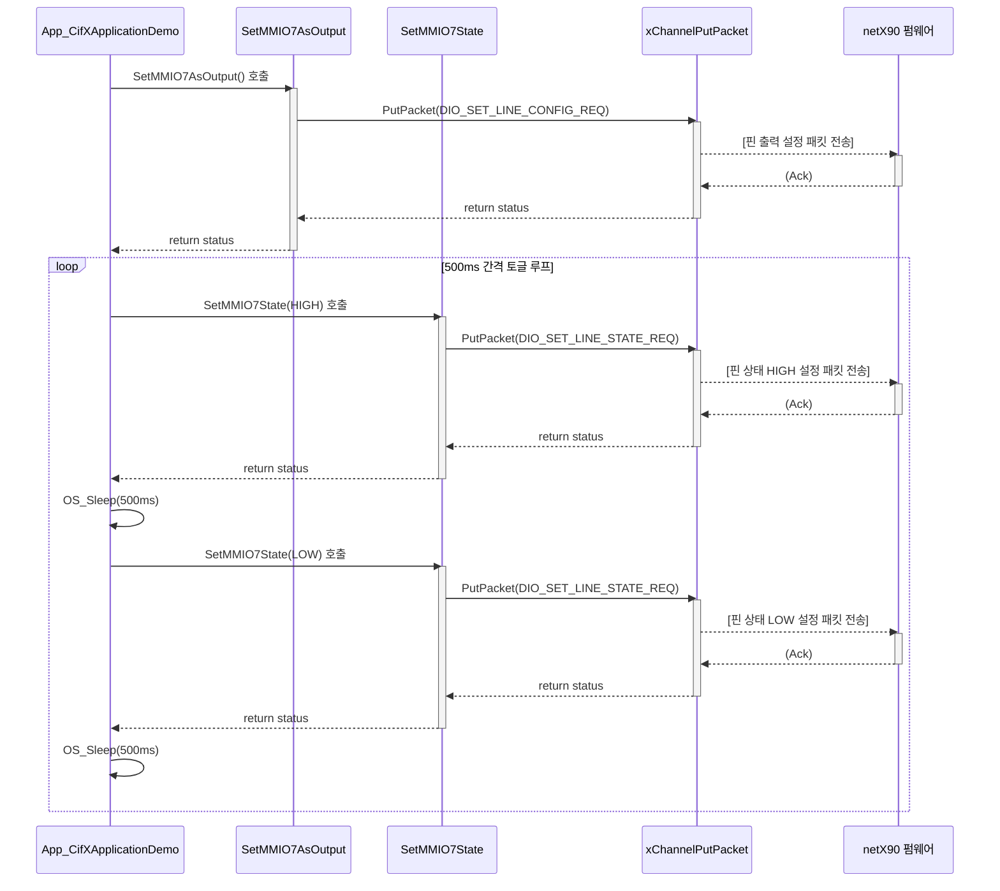

# MMIO7 제어 순서도 (Sequence Diagram)

이 문서는 `App_CifXApplicationDemo` 함수가 시작된 후 MMIO7을 제어하는 전체 과정을 순서도로 나타냅니다.

## 순서도

## 순서도 해설

1.  **초기화 (핀 출력 설정)**
    *   `App_CifXApplicationDemo` 함수는 `SetMMIO7AsOutput` 함수를 호출하여 MMIO7 핀을 출력으로 설정하도록 요청합니다.
    *   `SetMMIO7AsOutput` 함수는 `DIO_SET_LINE_CONFIG_REQ` 패킷을 생성합니다.
    *   `xChannelPutPacket` API를 통해 이 패킷이 netX90 펌웨어로 전송됩니다.
    *   netX90 펌웨어는 패킷을 수신하고 MMIO7을 출력으로 설정한 후, 응답(Ack)을 보냅니다.

2.  **실행 루프 (핀 상태 토글)**
    *   초기화가 완료되면, `App_CifXApplicationDemo`는 무한 루프에 진입합니다.
    *   루프 내에서 `SetMMIO7State` 함수를 주기적으로 호출하여 MMIO7의 상태를 HIGH 또는 LOW로 변경합니다.
    *   `SetMMIO7State` 함수는 `DIO_SET_LINE_STATE_REQ` 패킷을 생성하여 `xChannelPutPacket`으로 전송합니다.
    *   netX90 펌웨어는 이 패킷의 내용에 따라 MMIO7 핀의 출력 상태를 변경합니다.
    *   `OS_Sleep(500ms)`를 통해 500ms의 지연이 발생하며, 이 과정이 반복되어 핀이 토글됩니다.

D:\git\netx_90_f429_SPI5\20250721_mmio_flowchart_mermaid-164612.svg