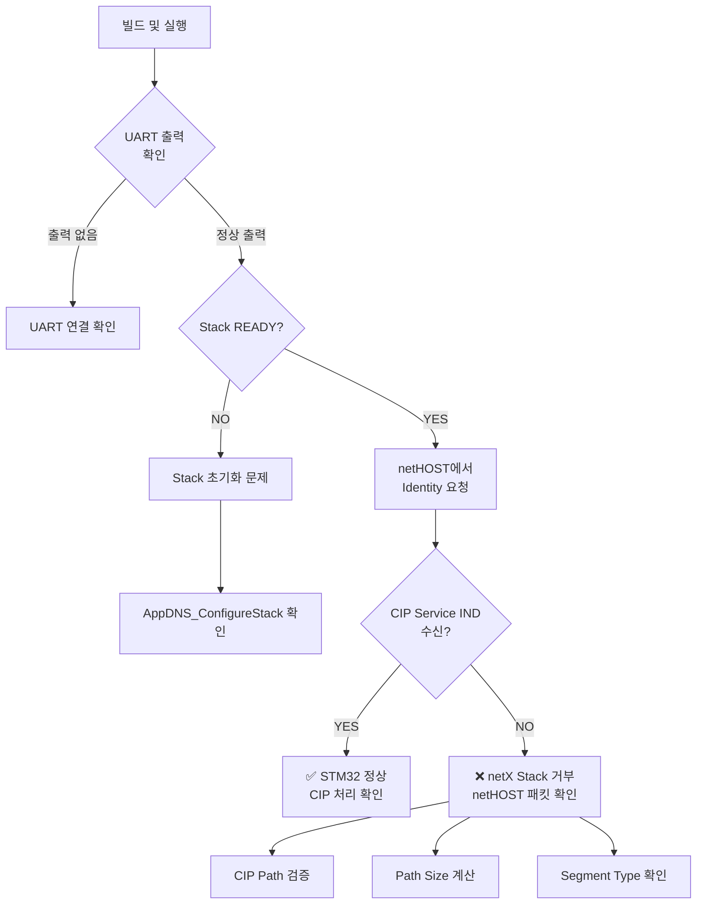

# DeviceNet Explicit Message 디버그 코드 추가 완료

**작성일**: 2025-11-07
**프로젝트**: netX90 F429 SPI5 DeviceNet Implementation

---

## ✅ 추가된 디버그 코드

### 1. PrintDeviceNetStatus() 함수 추가

**파일**: `Core/Src/main.c`
**위치**: Line 283-365

**기능**:
- Channel READY 상태 확인
- BUS ON 상태 확인
- 통신 상태 (RUN/STOP) 확인
- 설정 정보 출력 (Node ID, Baud Rate)
- 디바이스 정보 출력 (Serial Number, Firmware Version)
- 에러 상태 확인
- **Explicit 메시징 준비 상태 종합 판단**

**출력 예시**:
```
=============================================
  DeviceNet Stack Status
=============================================
Channel READY:     [OK] YES
BUS ON:            [OK] YES
Comm State:        [OK] RUN
Configured:        [OK] YES

--- Configuration ---
Node ID:           1
Baud Rate:         125 kB/s

--- Device Info ---
Device Number:     0
Serial Number:     1234567
Firmware:          5.3.0 build 1

--- Error Status ---
Application Error: [OK] None
Config Locked:     [OK] NO
=============================================

✅ Stack is READY for Explicit Messaging
```

---

### 2. main() 함수에 호출 추가

**파일**: `Core/Src/main.c`
**위치**: Line 1174

**위치**: DeviceNet Stack 초기화 성공 직후

```c
printf("DeviceNet Stack initialized successfully!\r\n");
printf("========================================\r\n\r\n");

/* ⭐ Print stack status for debugging Explicit messaging */
PrintDeviceNetStatus(&g_tAppData);
```

---

### 3. 패킷 핸들러 디버그 로그 추가

**파일**: `Hil_DemoAppDNS/Sources/AppDNS_DemoApplicationFunctions.c`
**위치**: Line 232-241

**기능**:
- 모든 수신 패킷의 Cmd, Len, State 출력
- DNS_CMD_CIP_SERVICE_IND 수신 시 명확한 표시

**출력 예시**:
```
[PKT] Cmd=0x0000B104, Len=32, State=0x00000000
[INFO] ✅ CIP Service Indication Received!

=== CIP Service Indication ===
Service:   0x0E (Get Attribute Single)
Class:     0x01
Instance:  0x01
Attribute: 0x01
```

---

## 🔧 다음 단계

### 단계 1: 빌드 및 플래시

**STM32CubeIDE**:
1. `Project` → `Build All` (Ctrl+B)
2. `Run` → `Debug` (F11) 또는 `Run` (Ctrl+F11)

**예상 빌드 시간**: 약 1-2분

---

### 단계 2: UART 출력 확인

**UART 설정**:
- 포트: USART1
- 속도: 115200 baud
- 데이터 비트: 8
- 패리티: None
- 정지 비트: 1

**기대 출력 (정상)**:
```
========================================
 STM32F429 + netX90 System Starting
========================================

========================================
 DeviceNet Stack Initialization
========================================

Step 1: Waiting for channel to be ready...
  Channel ready! COS Flags: 0x00000001

Step 2: Setting Host State to READY...
  Host State set to READY

Step 3: Calling Protocol_StartConfiguration...
  [OK] Protocol_StartConfiguration completed

Step 4: Initializing VAT Parameters...
  VAT Parameter Manager initialized (10 parameters)

========================================
DeviceNet Stack initialized successfully!
========================================

=============================================
  DeviceNet Stack Status
=============================================
Channel READY:     [OK] YES
BUS ON:            [OK] YES
...
✅ Stack is READY for Explicit Messaging

========================================
 Entering Main Communication Loop
========================================
```

---

### 단계 3: netHOST에서 Explicit 메시지 전송

**테스트 요청 (Identity Object)**:
```
Service:    0x0E (Get_Attribute_Single)
Class:      0x01 (Identity Object)
Instance:   0x01
Attribute:  0x01 (Vendor ID)

CIP 메시지: 0E 03 20 01 24 01 30 01
```

**기대 결과 A (정상)**:
```
[PKT] Cmd=0x0000B104, Len=32, State=0x00000000
[INFO] ✅ CIP Service Indication Received!

=== CIP Service Indication ===
Service:   0x0E (Get Attribute Single)
Class:     0x01
Instance:  0x01
Attribute: 0x01
Data Len:  0
  -> Get: Success, Data=94 01
Response:  Cmd=0x0000B105, Len=32, Error=0x00
==============================
```

**기대 결과 B (문제 - 패킷 미수신)**:
```
(아무 메시지 없음)

→ netX Stack이 패킷을 거부
→ netHOST 패킷 구조 확인 필요
```

**기대 결과 C (문제 - Stack 상태)**:
```
Channel READY:     [FAIL] NO
BUS ON:            [FAIL] NO
...
❌ Stack is NOT READY for Explicit Messaging

→ Stack 초기화 문제
→ AppDNS_ConfigureStack() 재확인
```

---

## 📊 디버깅 플로우차트



---

## 🎯 문제 해결 매트릭스

| 현상 | 원인 | 해결 방법 |
|------|------|----------|
| **UART 출력 없음** | UART 연결 또는 설정 문제 | - UART1 포트 확인<br>- 115200 baud 확인<br>- printf 리다이렉션 확인 |
| **Channel NOT READY** | Stack 초기화 실패 | - xChannelInfo 에러 코드 확인<br>- netX90 펌웨어 확인<br>- SPI 통신 확인 |
| **BUS OFF** | DeviceNet 버스 문제 | - 버스 연결 확인<br>- Duplicate MAC 확인<br>- Baud Rate 일치 확인 |
| **CIP IND 미수신** | netHOST 패킷 구조 문제 | - CIP Path 검증<br>- Path Size = 바이트/2<br>- Segment Type 확인 |
| **CIP Error 응답** | 파라미터 범위 또는 권한 | - Attribute ID 확인<br>- Read/Write 권한 확인<br>- 데이터 범위 확인 |

---

## 📁 수정된 파일

1. **Core/Src/main.c**
   - Line 157: PrintDeviceNetStatus() 프로토타입 추가
   - Line 283-365: PrintDeviceNetStatus() 함수 구현
   - Line 1174: 함수 호출 추가

2. **Hil_DemoAppDNS/Sources/AppDNS_DemoApplicationFunctions.c**
   - Line 232-235: 패킷 정보 디버그 로그 추가
   - Line 241: CIP Service Indication 수신 로그 추가

---

## 📚 관련 문서

1. **Docs/DeviceNet_Explicit_Troubleshooting_Guide.md**
   - 종합 문제 해결 가이드
   - 상세 체크리스트

2. **Docs/STM32_Debug_Code_Example.c**
   - 전체 디버그 코드 예제
   - 테스트 절차 및 예상 출력

3. **20251107_Explicit_Message_Analysis_Summary.md**
   - 분석 종합 보고서
   - ChatGPT 문서 검토 결과

---

## ✅ 완료 사항

- [x] PrintDeviceNetStatus() 함수 구현
- [x] main() 함수에 호출 추가
- [x] 패킷 핸들러 디버그 로그 추가
- [x] 문서화 완료

---

## 🔜 다음 작업

1. **빌드 및 실행**
   ```
   Project → Build All (Ctrl+B)
   Run → Debug (F11)
   ```

2. **UART 출력 확인**
   - Stack READY 확인
   - BUS ON 확인
   - ✅ "Stack is READY for Explicit Messaging" 메시지 확인

3. **netHOST 테스트**
   - Identity Object Get Attribute 요청 전송
   - UART에서 "CIP Service Indication Received" 확인

4. **결과 분석**
   - 정상: CIP 응답 확인
   - 문제: Troubleshooting Guide 참조

---

**작성자**: Claude Code
**기반**: 실제 프로젝트 코드 및 Hilscher API 문서
