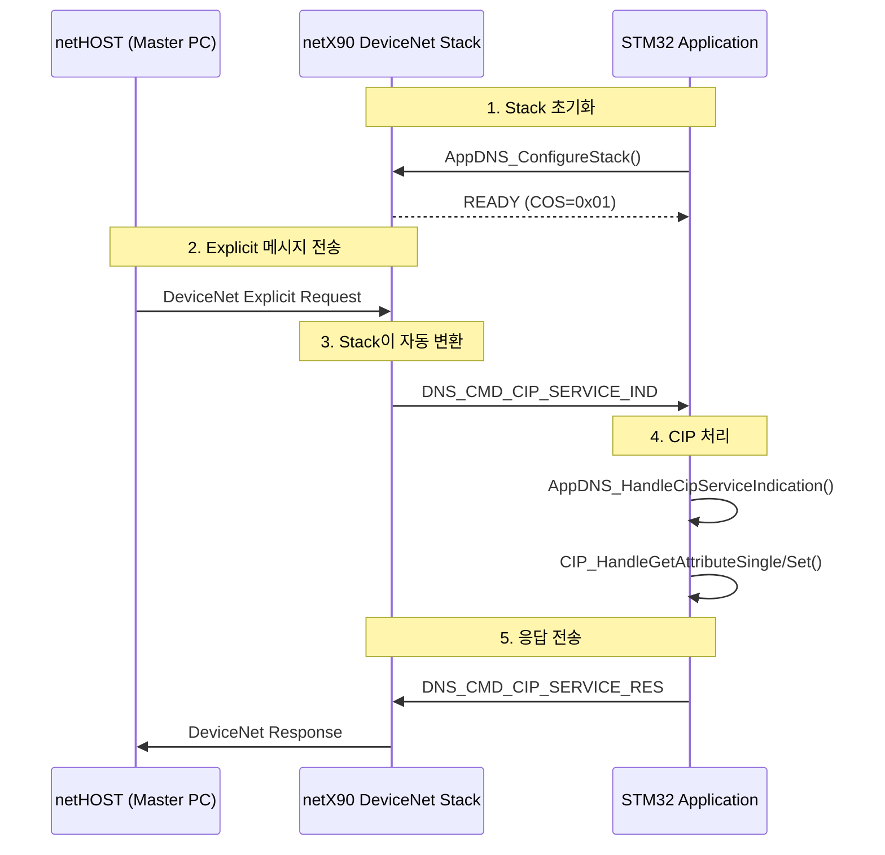

# DeviceNet Explicit Message 통신 분석 종합 보고서

**작성일**: 2025-11-07
**프로젝트**: netX90 F429 SPI5 DeviceNet Implementation
**작성자**: Claude Code (기존 분석 문서 기반)

---

## 📊 분석 결과 요약

### ✅ 확인된 정상 사항

1. **STM32 측 설정은 정상**
   - `ulConfigFlags = 0` ✅ (문서에 명시: "set 0")
   - `ulObjectFlags = 0` ✅ (문서에 명시: "set 0")
   - Explicit 메시지 핸들러 구현됨 ✅
   - VAT 파라미터 시스템 구현됨 ✅

2. **Hilscher DeviceNet Stack**
   - **UCMM을 기본적으로 지원** ✅
   - **별도의 UCMM 설정 불필요** ✅
   - EDS 파일에 UCMM 항목 없는 것이 정상 ✅

3. **I/O 메시징**
   - Hilscher Stack ↔ STM32 ↔ netHOST 정상 동작 ✅

---

### ❌ 식별된 문제

**현상**: netHOST에서 Explicit 메시지 전송 시 에러 응답
```
Cmd:   0x8021 (RCX_RECEIVE_PACKET_CNF)
Len:   0
State: 0xC0000004 (Invalid Parameter/Channel/Route)
```

**의미**: **netX90 Stack이 netHOST 요청을 거부함**

**결과**: STM32에 `DNS_CMD_CIP_SERVICE_IND` 전달되지 않음

---

## 🔍 ChatGPT 문서 검토 결과

### ❌ ChatGPT 문서 사용 불가 판정

**주요 문제점**:

1. **잘못된 API 사용**
   ```c
   // ❌ 존재하지 않는 함수
   RegisterAllCIPClasses();
   RegisterCIPClass(0x01, "Identity");

   // ❌ 존재하지 않는 명령어
   DEVNET_FAL_CMD_REGISTER_CLASS_REQ
   RCX_SEND_PACKET_REQ
   RCX_RECEIVE_PACKET_CNF
   ```

2. **잘못된 통신 메커니즘**
   - ChatGPT 문서: STM32에서 `RCX_SEND_PACKET_REQ`로 송신
   - 실제 프로젝트: STM32는 **Slave**로 `DNS_CMD_CIP_SERVICE_IND`만 수신

3. **혼동된 플랫폼**
   - ChatGPT 문서는 **netHOST (Master)** 관점의 코드
   - 실제 프로젝트는 **STM32 + netX90 Slave** 구조

**결론**: ChatGPT 문서는 **다른 프로젝트 또는 다른 역할(Master)** 을 위한 것으로 판단됨

---

## ✅ 실제 프로젝트 구조 (올바른 이해)



**핵심 이해**:
- STM32는 **수신만** 처리 (Slave 역할)
- netX90 Stack이 **DeviceNet ↔ DNS_CMD_CIP_SERVICE_IND 변환** 자동 처리
- STM32는 RCX 패킷을 **직접 송수신하지 않음**

---

## 🎯 문제 원인 분석

### 가능한 원인 (우선순위 순)

#### 1. **netHOST 요청 패킷 구조 문제** (가능성: 높음)
**증거**:
- STM32 설정은 정상
- I/O 메시징은 정상 동작
- Stack이 요청을 거부함 (`State=0xC0000004`)

**확인 방법**:
- CIP Path 형식 검증
- Path Size 계산 확인 (바이트/2)
- Segment Type 확인 (8-bit vs 16-bit)

**테스트**:
```
Identity Object Get Attribute:
0E 03 20 01 24 01 30 01
```

---

#### 2. **BUS 상태 문제** (가능성: 중간)
**확인 사항**:
- Channel READY 상태
- BUS ON 상태
- Duplicate MAC 여부

**확인 방법**:
디버그 코드 추가 (아래 참조)

---

#### 3. **netX90 Stack 내부 문제** (가능성: 낮음)
**가능성이 낮은 이유**:
- I/O 메시징은 정상 동작
- Hilscher Stack은 UCMM 기본 지원
- 설정 코드는 Hilscher 공식 예제 기반

---

## 🛠️ 다음 조치 사항

### 단계 1: STM32 디버그 코드 추가

**파일**: `Core/Src/main.c`

```c
// ⭐ 추가할 함수 (Docs/STM32_Debug_Code_Example.c 참조)
void PrintDeviceNetStatus(APP_DATA_T* ptAppData);

int main(void)
{
    // ... (기존 초기화 코드) ...

    AppDNS_ConfigureStack(&g_tAppData, 0);
    App_AllChannels_GetChannelInfo_WaitReady(&g_tAppData);

    // ⭐ 상태 확인 코드 추가
    PrintDeviceNetStatus(&g_tAppData);

    while (g_tAppData.fRunning)
    {
        App_IODataHandler(&g_tAppData);
        App_AllChannels_PacketHandler(&g_tAppData);
        OS_Sleep(1);
    }

    return 0;
}
```

**기대 출력**:
```
=============================================
  DeviceNet Stack Status
=============================================
Channel READY:     [OK] YES
BUS ON:            [OK] YES
Comm State:        [OK] RUN
...
✅ Stack is READY for Explicit Messaging
```

---

### 단계 2: netHOST 테스트 요청

**간단한 테스트 (Identity Object)**:
```
Service:    0x0E (Get_Attribute_Single)
Path:       20 01 24 01 30 01
→ 전체:    0E 03 20 01 24 01 30 01
```

**기대 결과**:
```
[INFO] ✅ CIP Service Indication Received!
=== CIP Service Indication ===
Service:   0x0E (Get Attribute Single)
Class:     0x01
Instance:  0x01
Attribute: 0x01
  -> Get: Success, Data=94 01  (Vendor ID = 404)
```

---

### 단계 3: 문제 분석

**시나리오 A: UART에 "CIP Service Indication" 출력됨**
→ ✅ STM32 핸들러 정상
→ CIP 서비스 처리 로직 확인

**시나리오 B: UART에 아무 메시지 없음**
→ ❌ netX Stack이 패킷 거부
→ **netHOST 요청 패킷 구조 재확인 필요**

**시나리오 C: Channel NOT READY 또는 BUS OFF**
→ ❌ Stack 초기화 문제
→ `AppDNS_ConfigureStack()` 재확인

---

## 📁 생성된 문서

### 1. `Docs/DeviceNet_Explicit_Troubleshooting_Guide.md`
**내용**: 종합 문제 해결 가이드
- 문제 상황 분석
- 가능한 원인 및 해결 방법
- 단계별 디버깅 절차
- 체크리스트

### 2. `Docs/STM32_Debug_Code_Example.c`
**내용**: 디버그 코드 예제
- `PrintDeviceNetStatus()` 함수
- Enhanced Packet Handler
- 테스트 절차
- 예상 출력

### 3. `20251107_Explicit_Message_Analysis_Summary.md` (이 문서)
**내용**: 분석 종합 보고서

---

## 📚 참고 문서 (신뢰 가능)

### ✅ 실제 프로젝트 기반 문서
1. **20251107_explicit_msg_code_analysis.md** - 실제 코드 분석
2. **20251107_explicit_msg_error_analysis.md** - 에러 분석
3. **20251106_Hilscher_Explicit_Message_Analysis.md** - Hilscher API 분석
4. **20251106_Explicit_Message_Implementation_Summary.md** - 구현 요약

### ❌ 사용 불가 문서
- **chagpt_explicit_msg_error.md** (ChatGPT 대화) - 다른 프로젝트/역할 기반

---

## 💡 핵심 결론

### 1. STM32 코드는 정상
- UCMM 설정 불필요 (Stack 기본 지원)
- Explicit 핸들러 구현 완료
- VAT 파라미터 시스템 구현 완료

### 2. 문제는 외부 요인
- netHOST 요청 패킷 구조
- 또는 BUS/Stack 상태

### 3. 다음 단계는 명확
1. 디버그 코드 추가
2. UART 출력 확인
3. Identity Object 테스트
4. 결과에 따라 조치

---

## 🔗 추가 지원

### Hilscher 공식 문서
- `readme_dns.pdf` - DeviceNet Slave Stack 매뉴얼
- Hilscher Support: support@hilscher.com

### 프로젝트 내 참조 코드
- `Hil_DemoAppDNS/Sources/AppDNS_ExplicitMsg.c` - CIP 서비스 핸들러
- `Hil_DemoAppDNS/Sources/AppDNS_DemoApplicationFunctions.c` - Stack 설정
- `Hil_DemoApp/Sources/App_VAT_Parameters.c` - 파라미터 관리

---

**최종 업데이트**: 2025-11-07
**분석 기반**: 실제 프로젝트 코드, Hilscher API 문서, 에러 로그
