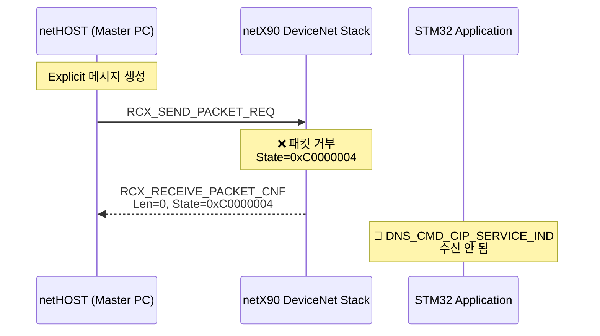

# DeviceNet Explicit Message Troubleshooting Guide

**작성일**: 2025-11-07
**프로젝트**: netX90 F429 SPI5 DeviceNet Implementation
**목적**: Explicit 메시지 통신 문제 해결 가이드

---

## 📊 현재 상황 요약

### ✅ 정상 동작
- **I/O 메시징**: Hilscher Stack + STM32 디바이스와 netHOST 간 정상 통신 확인
- **Stack 초기화**: AppDNS_ConfigureStack() 정상 완료
- **BUS 상태**: BUS ON, 통신 준비 완료

### ❌ 문제 상황
- **Explicit 메시징**: netHOST에서 보낸 요청에 대해 에러 응답
- **에러 코드**: `State=0xC0000004`, `Len=0` (패킷 처리 실패)
- **STM32**: `DNS_CMD_CIP_SERVICE_IND` 수신되지 않음

---

## 🔍 핵심 발견 사항

### 1. **Hilscher DeviceNet Stack UCMM 지원 방식**

#### ✅ 확인된 사실
1. **Hilscher DeviceNet Slave Stack은 UCMM을 기본적으로 지원**
2. **별도의 UCMM 설정이 필요 없음**
3. **EDS 파일에 UCMM 관련 항목 없음** (정상)

#### 📄 코드 증거
**파일**: `Hil_DemoAppDNS/includes/DNS_API/DNS_packet_set_configuration.h:106-107`
```c
uint32_t ulConfigFlags; /*!< Configuration flags. These flags are not used, set 0. */
uint32_t ulObjectFlags; /*!< Object Configuration flags. These flags are not used, set 0. */
```

**현재 설정**: `AppDNS_DemoApplicationFunctions.c:115-116`
```c
ptCfg->ulConfigFlags = 0;  // ✅ 올바른 설정
ptCfg->ulObjectFlags = 0;  // ✅ 올바른 설정
```

**결론**: **STM32 측 설정은 정상입니다.**

---

### 2. **실제 문제 위치**



**문제 위치**: **netX90 DeviceNet Stack이 netHOST 요청을 거부**

---

## 🎯 가능한 원인 및 해결 방법

### 우선순위 1: **netHOST 요청 패킷 구조 확인**

#### 확인 사항
1. **CIP Path 형식**
   ```
   Service(1B) | PathSizeInWords(1B) | CIP Path(2*PathSize bytes) | Data(N bytes)
   ```

2. **Path Size 계산**
   - PathSizeInWords = Path 바이트 수 / 2
   - 예: 6바이트 Path → PathSize = 0x03

3. **Segment Type 확인**
   ```
   0x20 = 8-bit Class
   0x24 = 8-bit Instance
   0x30 = 8-bit Attribute

   0x21 = 16-bit Class (값이 0xFF 초과인 경우)
   0x25 = 16-bit Instance
   0x31 = 16-bit Attribute
   ```

#### 테스트 예제
**올바른 Get_Attribute_Single 요청**:
```
0E 03 20 30 24 01 30 0C
```
- `0x0E` = Get_Attribute_Single
- `0x03` = Path size (6 bytes / 2 = 3 words)
- `20 30` = Class 0x30
- `24 01` = Instance 0x01
- `30 0C` = Attribute 0x0C

**올바른 Set_Attribute_Single 요청**:
```
10 03 20 30 24 01 30 0C 05
```
- 위와 동일 + Data `0x05` (1 byte)

---

### 우선순위 2: **BUS 상태 및 Stack 초기화 확인**

#### 체크리스트

**1. Channel READY 확인**
```c
// main.c 또는 초기화 코드에서 확인
CHANNEL_INFORMATION tInfo;
xChannelInfo(hChannel, sizeof(tInfo), &tInfo);

if (tInfo.ulDeviceCOSFlags & HIL_COMM_COS_READY) {
    printf("[OK] Channel READY\n");
} else {
    printf("[ERROR] Channel NOT READY\n");
}
```

**2. BUS 상태 확인**
```c
// BUS ON 상태 확인
if (tInfo.ulCommunicationCOS & HIL_COMM_COS_BUS_ON) {
    printf("[OK] BUS ON\n");
} else {
    printf("[ERROR] BUS OFF\n");
}
```

**3. Duplicate MAC 확인**
- netHOST의 스캔 결과에서 동일한 MAC ID를 가진 디바이스가 있는지 확인
- 현재 MAC ID: `ptCfg->ulNodeId = g_tAppDnsData.bNodeIdValue` (기본값: 1)

---

### 우선순위 3: **STM32 패킷 핸들러 확인**

#### 핸들러 동작 확인

**파일**: `Hil_DemoAppDNS/Sources/AppDNS_DemoApplicationFunctions.c:234`

```c
case DNS_CMD_CIP_SERVICE_IND:
    printf("=== CIP Service Indication Received ===\n");  // 추가
    AppDNS_HandleCipServiceIndication(ptAppData);
    fPacketHandled = true;
    break;
```

#### 확인 방법
1. UART 로그에 `"=== CIP Service Indication Received ==="` 메시지가 출력되는지 확인
2. 출력되지 않으면: **netX Stack이 Explicit 메시지를 STM32로 전달하지 않음**
3. 출력되면: **핸들러는 정상, 다른 문제**

---

## 🛠️ 디버깅 단계

### 단계 1: STM32 상태 확인

```c
// main.c 초기화 완료 후 추가
printf("\n=== DeviceNet Stack Status ===\n");
printf("Channel READY: %s\n",
    (tInfo.ulDeviceCOSFlags & HIL_COMM_COS_READY) ? "YES" : "NO");
printf("BUS ON: %s\n",
    (tInfo.ulCommunicationCOS & HIL_COMM_COS_BUS_ON) ? "YES" : "NO");
printf("Node ID: %d\n", g_tAppDnsData.bNodeIdValue);
printf("==============================\n\n");
```

### 단계 2: netHOST 요청 패킷 확인

**netHOST 측에서 확인해야 할 사항**:
1. Explicit 메시지 전송 시 사용한 패킷 구조
2. Path Size 계산이 올바른지
3. Segment Type이 올바른지
4. 데이터 길이가 올바른지

### 단계 3: 간단한 테스트 요청

**Identity Object (Class 0x01) Get Attribute Single 테스트**:
```
0E 03 20 01 24 01 30 01
```
- Class 0x01 (Identity Object)
- Instance 0x01
- Attribute 0x01 (Vendor ID)

이 요청은 **모든 DeviceNet 디바이스가 지원**해야 하므로,
이것이 실패하면 **근본적인 통신 문제**입니다.

---

## 📋 체크리스트

### STM32 측 확인 사항
- [x] `ulConfigFlags = 0` 설정 확인
- [x] `ulObjectFlags = 0` 설정 확인
- [ ] Channel READY 상태 확인
- [ ] BUS ON 상태 확인
- [ ] `DNS_CMD_CIP_SERVICE_IND` 핸들러 동작 확인
- [ ] UART 디버그 메시지 확인

### netHOST 측 확인 사항
- [ ] CIP Path 구조 검증
- [ ] Path Size 계산 확인
- [ ] Segment Type 확인
- [ ] Identity Object 테스트 (Class 0x01)
- [ ] 짧은 데이터(<8바이트)로 테스트

### Stack 상태 확인
- [ ] Duplicate MAC 없음 확인
- [ ] BUS 속도 일치 확인 (기본값: 125kB)
- [ ] netX90 펌웨어 버전 확인

---

## 🔧 추가 디버깅 도구

### UART 로그 활성화

**파일**: `Core/Src/main.c`
```c
// main() 함수 시작 부분
printf("\n\n====================================\n");
printf("DeviceNet Slave Application Started\n");
printf("====================================\n\n");
```

**파일**: `Hil_DemoAppDNS/Sources/AppDNS_DemoApplicationFunctions.c:403`
```c
void AppDNS_HandleCipServiceIndication(APP_DATA_T* ptAppData)
{
    // 기존 디버그 로그가 이미 구현되어 있음
    printf("\n=== CIP Service Indication ===\n");
    // ... (나머지 코드)
}
```

---

## 💡 예상 결과

### 시나리오 1: UART에 "CIP Service Indication" 출력됨
→ **STM32 핸들러는 정상**
→ CIP 서비스 처리 로직 확인 필요

### 시나리오 2: UART에 아무 메시지 없음
→ **netX Stack이 패킷을 STM32로 전달하지 않음**
→ netHOST 요청 패킷 구조 문제 가능성 높음

### 시나리오 3: Channel NOT READY 또는 BUS OFF
→ **Stack 초기화 문제**
→ `AppDNS_ConfigureStack()` 재확인 필요

---

## 📚 참고 자료

### 관련 문서
- `20251107_explicit_msg_code_analysis.md` - 실제 코드 분석
- `20251107_explicit_msg_error_analysis.md` - 에러 분석
- `20251106_Hilscher_Explicit_Message_Analysis.md` - Hilscher API 분석

### Hilscher 문서
- `readme_dns.pdf` - DeviceNet Slave Stack 매뉴얼
- `DNS_packet_set_configuration.h` - 설정 구조체 정의
- `DNS_packet_cip_service.h` - CIP 서비스 패킷 정의

---

## ✅ 다음 단계

1. **STM32 상태 확인 코드 추가** → 빌드 → 실행
2. **UART 로그 확인**
3. **netHOST에서 Identity Object 테스트 요청 전송**
4. **결과 분석 후 추가 조치**

---

**작성자**: Claude Code
**기반 분석**: 실제 프로젝트 코드 및 Hilscher API 문서
