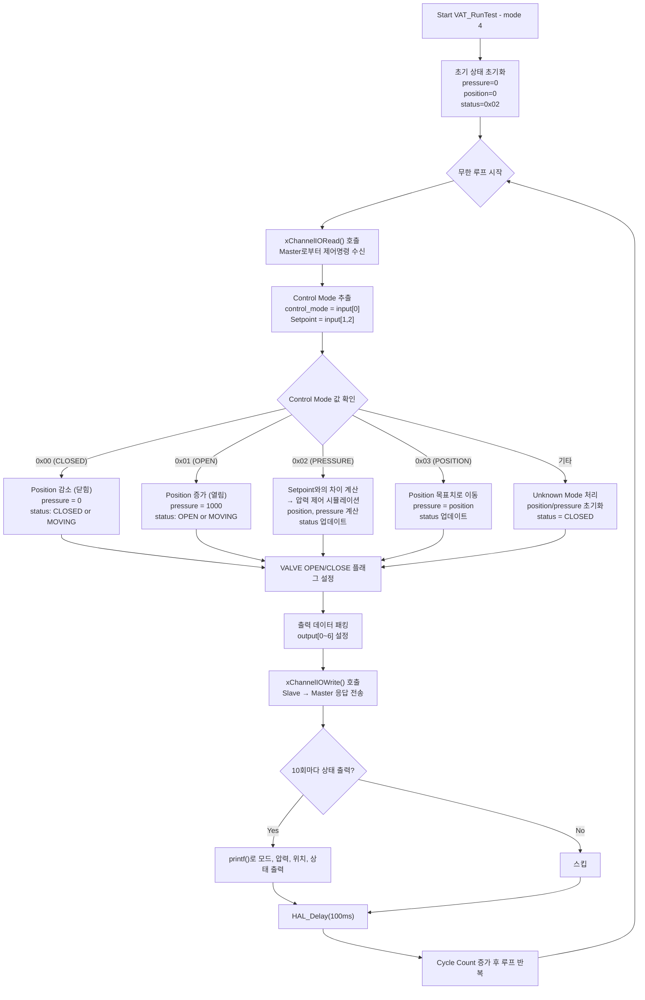

You: 

지식 검색이 중지되었습니다

✅ **main.c 코드 분석 요약** (`main.c`)

---

## 🔧 전체 기능 개요

이 STM32 프로젝트는 **STM32F429** MCU와 **netX90** 칩 간 **SPI/UART 통신**을 기반으로, **DeviceNet 통신 및 VAT(Vacuum Adaptive Test) 시뮬레이션/제어 테스트**를 수행하는 펌웨어입니다. 특히 **Hilscher사의 cifX API**를 사용하여 netX90을 통해 DeviceNet 프로토콜을 제어하고 있습니다.

---

## 🧱 주요 구조 및 흐름

### 1\. **초기화 루틴**

-   `main()` 함수에서 다음 순서로 초기화:
    
    -   HAL 초기화 → 클럭 설정 → GPIO, UART, SPI, TIM 초기화
        
    -   `UART_Ring_Init()` 호출 → UART5 인터럽트 기반 수신 시작
        
    -   `printf()` 설정 완료 후 디버깅 메시지 출력
        
    -   `InitializeToolkit()` 호출 → netX 통신 설정
        
    -   `g_bEnableVatTest == true` 이면 VAT 관련 테스트 로직 수행
        

---

### 2\. **DeviceNet Stack 초기화**

-   `AppDNS_ConfigureStack()` 호출로 DeviceNet 스택 설정
    
-   채널 초기화 대기 (`HIL_COMM_COS_READY`)
    
-   이후 netX 채널 정보 출력
    

---

### 3\. **VAT 테스트 루틴 (핵심 기능)**

-   `g_VatTestMode` 값에 따라 아래 테스트 수행:
    
    -   `1`: Basic Pressure Control
        
    -   `2`: Full Calibration
        
    -   `3`: Continuous Monitoring
        
    -   `4`: **실제 VAT 시뮬레이션 (∞ 루프)** ✅ 현재 활성화됨
        

### 4\. **VAT 시뮬레이션 동작 (mode 4)**

-   Master → Slave 명령 수신 (`xChannelIORead`)
    
-   슬레이브 내부 `current_position`, `current_pressure` 값 업데이트
    
-   Slave → Master 응답 전송 (`xChannelIOWrite`)
    
-   100ms 주기로 반복하며 동작 상태를 UART로 출력
    

---

## 🔁 주요 통신 포인트

| 방향 | 프로토콜 | 함수 / 드라이버 | 설명 |
| --- | --- | --- | --- |
| STM32 → netX | SPI | `SerialDPM_Init`, `HAL_SPI_*` | DPM 초기화 및 통신 설정 |
| STM32 ↔ netX | UART | `huart5`, `huart1` | UART5 → printf 리디렉션 등 |
| Master ↔ Slave | DeviceNet | `xChannelIORead`, `xChannelIOWrite` | 실제 입출력 데이터 전송 |
| 내부 ↔ 내부 | UART Ring | `UART_Ring_Init`, `UART_Ring_ReadLine` | DIP switch 문자열 수신 |

---

## 💡 하드웨어 연동

-   SPI: `SPI4` 사용 (Baudrate Prescaler = 8)
    
-   UART: `UART5` & `USART1` 사용
    
-   GPIO: CS핀 등 통신 제어용 GPIO 다수 설정
    
-   Timer: `TIM1`, `TIM3` 사용 (기능 명시 X)
    
-   DeviceNet Stack 사용을 위한 외부 헤더 및 핸들 사용:
    
    -   `g_tAppData`
        
    -   `g_tRealtimeProtocolHandlers`
        

---

## 🚨 특이사항 및 개선 포인트

| 항목 | 설명 |
| --- | --- |
| 🔄 무한 루프 | `VAT_RunTest()` mode 4는 무한 루프를 돌며 UART 출력이 많아 Watchdog 설정 필요 |
| ⚠️ SPI 재시도 없음 | `InitializeToolkit()` → `SerialDPM_Init()` 후 실패 시 재시도 로직 부족 |
| ✅ 디버깅 친화적 | UART printf, 구조체 전역 모니터링 변수 등 디버깅에 유리한 구조 |
| 🧪 DIP 스위치 파싱 | `UART_Ring_ReadLine()` 및 `ValidateDipSwitchData()`로 DIP값 파싱 |
| 🧠 시뮬레이터 내장 | mode 4: 내부적으로 VAT를 실제로 시뮬레이션하여 센서값 변경 |

---

## 📌 주요 함수 설명

| 함수명 | 기능 요약 |
| --- | --- |
| `main()` | 전체 초기화 및 테스트 진입점 |
| `InitializeToolkit()` | netX90 Toolkit 초기화 및 장치 추가 |
| `PrintDeviceInformation()` | netX 디바이스 및 채널 정보 UART 출력 |
| `VAT_InitializeTest()` | VAT 테스트 컨텍스트 및 설정 초기화 |
| `VAT_RunTest()` | 현재 선택된 테스트 모드에 따라 시뮬레이션 수행 |
| `UART_Ring_Init()` | UART 인터럽트 링버퍼 초기화 |
| `UART_Ring_ReadLine()` | UART 버퍼로부터 '\\r'까지 수신된 문자열 라인 추출 |
| `isCookieAvailable()` | DPM signature 체크로 netX가 정상적으로 기동 중인지 확인 |

---

## 🧩 함수 목록 및 설명 (부록)

| 함수명 | 설명 |
| --- | --- |
| `main()` | 메인 엔트리포인트 |
| `SystemClock_Config()` | 시스템 클럭 설정 |
| `MX_GPIO_Init()` | GPIO 초기화 |
| `MX_UART5_Init()` | UART5 설정 |
| `MX_USART1_UART_Init()` | USART1 설정 |
| `MX_TIM1_Init()`, `MX_TIM3_Init()` | 타이머 설정 (현재 기능 미사용) |
| `MX_SPI4_Init()` | SPI4 마스터 모드 초기화 |
| `InitializeToolkit()` | CIFX Toolkit 초기화 및 디바이스 등록 |
| `PrintDeviceInformation()` | netX 디바이스 정보 출력 |
| `VAT_InitializeTest()` | VAT 테스트 설정 초기화 |
| `VAT_RunTest()` | 현재 설정된 VAT 테스트 실행 |
| `UART_Ring_Init()` | UART 링버퍼 및 인터럽트 수신 설정 |
| `UART_Ring_ReadLine()` | UART 라인 단위 데이터 수신 |
| `HAL_UART_ErrorCallback()` | UART 에러 처리 콜백 |
| `HAL_UART_RxCpltCallback()` | UART 수신 완료 콜백 (링버퍼 업데이트) |

---

**💡 다음 액션을 선택할 수 있습니다:**

-   `d` : 분석한 코드의 순서도 작성
    
-   `m` : 순서도를 mermaid 형식으로 출력
    
-   `k` : 방금 내용을 다시 한글로 요약
    
-   `a` : mermaid 출력 형식 정제 (괄호 처리 등)

ChatGPT: 

4\. VAT 시뮬레이션 동작 (mode 4) Master → Slave 명령 수신 (xChannelIORead) 슬레이브 내부 current\_position, current\_pressure 값 업데이트 Slave → Master 응답 전송 (xChannelIOWrite) 100ms 주기로 반복하며 동작 상태를 UART로 출력 이 동작을 상세한 순서도 작성

You: 

아래는 요청하신 **VAT 시뮬레이션 동작 (mode 4)** 의 전체 루프에 대한 **상세 순서도**입니다. STM32 MCU가 netX90으로부터 DeviceNet 명령을 수신하고, 시뮬레이션된 압력 및 밸브 상태를 계산하여 응답하는 흐름을 시각적으로 표현했습니다.

---

### ✅ 순서도: VAT 시뮬레이션 동작 (mode 4)



---

### 🔍 순서도 주요 키워드 설명

-   `xChannelIORead()`: Master가 보낸 DeviceNet 명령 읽음
    
-   `control_mode`: 0=CLOSE, 1=OPEN, 2=PRESSURE, 3=POSITION
    
-   `xChannelIOWrite()`: 시뮬레이션된 데이터를 Master에게 다시 전송
    
-   `HAL_Delay(100ms)`: 주기적인 제어를 위한 딜레이
    
-   `printf()`: UART를 통한 상태 모니터링 로그
    

---

필요하신 경우 아래 명령을 통해 추가 작업이 가능합니다:

-   `a` : 위 mermaid 코드의 괄호 및 포맷 정제
    
-   `k` : 위 내용을 한글로 다시 설명
    
-   `d` : 이미지 스타일 순서도로 다시 작성 (텍스트 기반 설명 중심)

ChatGPT: 

코드에서 모드 2 이며 set point 값을 받았을 때 시뮬레이션에서 uart log에서 pressure 값외에 position 값도 변하는 에러가 있었다. 모드 3 에서는 position 값만 변해야하는데 pressure 값도 변하는 에러. 원인 분석

You: 

좋습니다. 질문 요지는 다음과 같습니다:

---

### ❓ 문제 상황 요약:

-   **모드 2 (PRESSURE)**:
    
    -   🟢 **기대 동작**: 압력(`current_pressure`)만 제어됨
        
    -   🔴 **문제 현상**: `current_position` 값도 계속 변화함 ❌
        
-   **모드 3 (POSITION)**:
    
    -   🟢 **기대 동작**: 위치(`current_position`)만 제어됨
        
    -   🔴 **문제 현상**: `current_pressure`도 계속 변화함 ❌
        

---

### 🔍 원인 분석: 시뮬레이션 내부 로직 확인

**시뮬레이터 핵심 코드 위치 (mode 2, 3):**

```c
switch(control_mode)
{
    ...
    case 0x02:  // PRESSURE 모드
        int16_t pressure_error = control_setpoint - g_tVatSimState.current_pressure;

        // 압력 제어 중 위치 변경
        if (pressure_error > 0) {
            g_tVatSimState.current_position += 5;
        } else {
            g_tVatSimState.current_position -= 5;
        }

        // 압력 계산 = (위치 * Setpoint) / 1000
        g_tVatSimState.current_pressure =
            (g_tVatSimState.current_position * control_setpoint) / 1000;
        break;

    case 0x03:  // POSITION 모드
        int16_t position_error = control_setpoint - g_tVatSimState.current_position;

        // 위치 제어
        if (position_error > 0) {
            g_tVatSimState.current_position += 10;
        } else {
            g_tVatSimState.current_position -= 10;
        }

        // 압력 = 위치 (즉, pressure = current_position)
        g_tVatSimState.current_pressure = g_tVatSimState.current_position;
        break;
}
```

---

### ❗ 문제 원인 요약

| 항목 | 문제 설명 |
| --- | --- |
| **모드 2** | `current_position`을 **의도적으로 조정**하고 있음 → 의도된 동작이긴 하나, 외부 기준에서는 압력만 바뀌기를 기대할 수 있음 |
| **모드 3** | `current_pressure = current_position;`으로 자동 연동되어 있음 → **위치가 바뀌면 압력도 같이 바뀜** → 논리적으로 분리 안됨 |

즉, **pressure와 position의 시뮬레이션 모델이 완전히 decouple(독립)** 되어 있지 않아서 발생한 문제입니다.

---

### 🛠 해결 방안 (추천)

#### ✅ 모드 2: PRESSURE 제어일 때

-   **현재 동작**: 압력을 맞추기 위해 위치를 조정함 → 실제 물리적 시스템에선 자연스러움
    
-   **해결책 (선택적)**: position 값은 그대로 유지하고 내부적으로만 압력 계산
    
    ```c
    // 수정안
    g_tVatSimState.current_pressure = control_setpoint;
    // g_tVatSimState.current_position += ...  → 제거 또는 고정값 유지
    ```
    

#### ✅ 모드 3: POSITION 제어일 때

-   **문제**: 압력을 위치에 따라 자동 계산
    
    ```c
    g_tVatSimState.current_pressure = g_tVatSimState.current_position;  // ❌ 이 부분
    ```
    
-   **해결책**: 압력은 고정값 또는 시뮬레이션 영향 제외
    
    ```c
    // pressure 유지
    // g_tVatSimState.current_pressure = ...; 제거
    ```
    

---

### ✅ 결론: 핵심 원인 요약

| 구분 | 원인 |
| --- | --- |
| PRESSURE 모드 | 압력을 맞추기 위해 `position`을 움직이도록 시뮬레이터가 설계됨 |
| POSITION 모드 | `position`을 바꾸면서 `pressure = position` 으로 계산해 압력도 자동 변경됨 |
| 공통 문제 | `pressure`, `position` 간 의존성이 **코드 상에 직접 연결**되어 있어 분리 불가능한 상태 |

---

필요 시, 분리형 시뮬레이션 모델을 제안드릴 수 있습니다.  
다음 단계로 추천:

-   `VAT_SIM_STATE_T`를 모드별 별도 변수로 구조화
    
-   `mode == 3`일 때 pressure 업데이트 제거
    

---

필요한 추가 작업:

-   `d` : 이 시뮬레이션 동작 흐름 순서도 그리기
    
-   `m` : mermaid 형식으로 흐름도 출력
    
-   `k` : 이 내용을 다시 한글로 설명
    
-   `a` : 출력된 mermaid 코드 정리