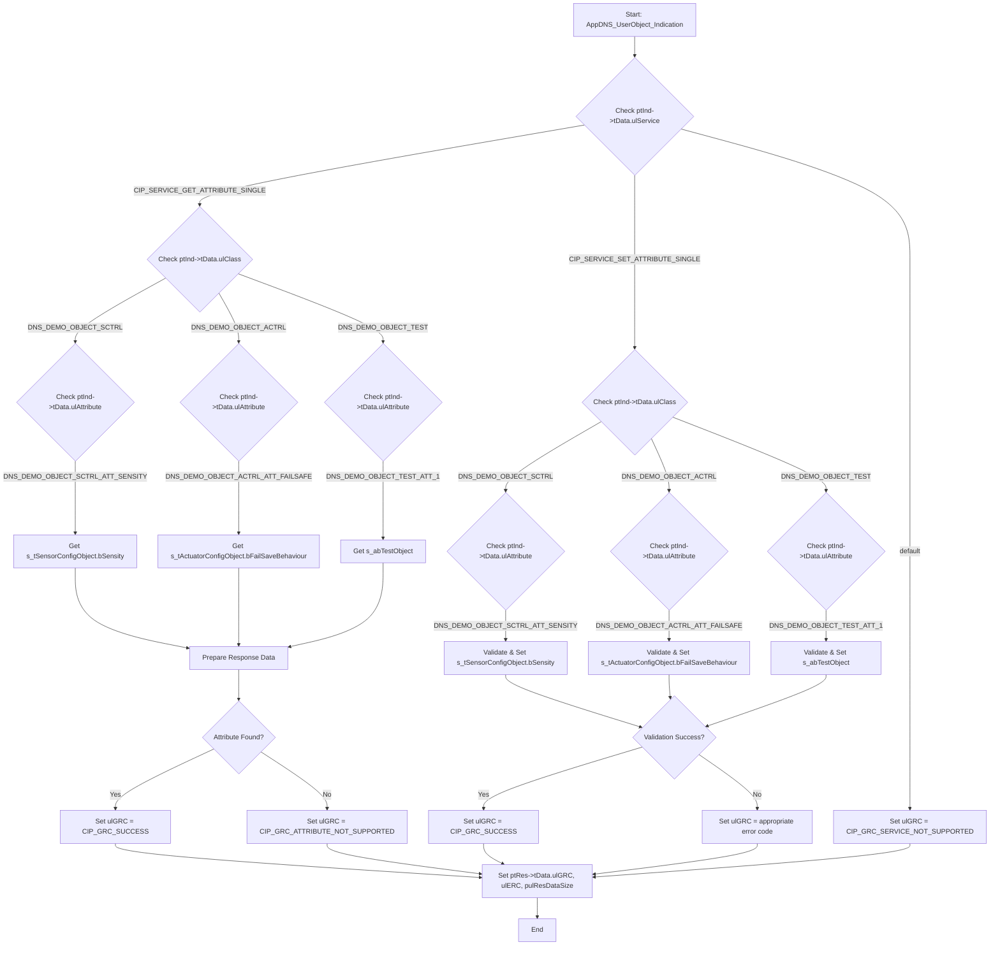

### `AppDNS_DemoApplication_UserObject.c` 코드 분석

이 파일은 사용자 정의 DeviceNet 객체(User Object)를 정의하고, 이러한 객체에 대한 CIP 서비스 요청을 처리하는 데 중점을 둡니다.

**주요 구성 요소:**

1.  **사용자 객체 정의:**
    *   `DNS_DEMO_OBJECT_SCTRL` (센서 제어, 클래스 100): 감도(Sensity) 속성을 가집니다.
    *   `DNS_DEMO_OBJECT_ACTRL` (액추에이터 제어, 클래스 101): 페일세이프(Failsafe) 동작 속성을 가집니다.
    *   `DNS_DEMO_OBJECT_TEST` (테스트 객체, 클래스 102): 테스트용 속성을 가집니다.
    *   이러한 객체들은 `SENSOR_CONFIG_OBJECT_T`, `ACTUATOR_CONFIG_OBJECT_T`, `s_abTestObject`와 같은 정적 데이터 구조를 통해 속성 값을 저장하고 관리합니다.

2.  **객체 등록 메커니즘:**
    *   `s_atCipRegisterObjDir`: DeviceNet 스택에 등록될 사용자 정의 객체 목록입니다.
    *   `AppDNS_RegisterObject`: `DNS_CMD_REGISTER_CLASS_REQ` 패킷을 스택으로 전송하여 특정 CIP 클래스를 등록하는 헬퍼 함수입니다.
    *   `AppDNS_UserObject_Registration`: `s_atCipRegisterObjDir` 목록을 순회하며 각 사용자 정의 객체를 스택에 등록하여 DeviceNet 네트워크에서 접근 가능하게 만듭니다.

3.  **사용자 객체 Indication 핸들러 (`AppDNS_UserObject_Indication`):**
    *   이 함수는 호스트 애플리케이션에 등록된 사용자 객체를 대상으로 하는 CIP 요청(explicit message)을 처리하도록 설계되었습니다.
    *   **인자:**
        *   `ptDnsRsc`: 리소스 포인터.
        *   `ptInd`: 수신된 CIP 요청의 세부 정보(서비스, 클래스, 인스턴스, 속성, 데이터)를 포함하는 `DNS_PACKET_CIP_SERVICE_IND_T` (indication 패킷) 포인터.
        *   `ptRes`: 처리 결과를 채울 `DNS_PACKET_CIP_SERVICE_RES_T` (응답 패킷) 포인터.
        *   `pulResDataSize`: 응답 데이터의 크기를 저장할 포인터.
    *   **로직:** `ptInd->tData.ulService` (CIP 서비스 코드)에 따라 `switch` 문으로 분기합니다.
        *   **`CIP_SERVICE_GET_ATTRIBUTE_SINGLE`**: 객체의 단일 속성 읽기 요청을 처리합니다.
            *   `ptInd->tData.ulClass`와 `ptInd->tData.ulAttribute`를 통해 대상 객체(Sensor, Actuator, Test)를 식별합니다.
            *   해당 속성 값을 정적 변수에서 가져와 응답 패킷에 준비합니다.
            *   `ulGRC` (General Response Code)를 `CIP_GRC_SUCCESS` 또는 `CIP_GRC_ATTRIBUTE_NOT_SUPPORTED`로 설정합니다.
        *   **`CIP_SERVICE_SET_ATTRIBUTE_SINGLE`**: 객체의 단일 속성 쓰기 요청을 처리합니다.
            *   GET 서비스와 유사하게 대상 객체와 속성을 식별합니다.
            *   수신된 데이터의 길이 및 값에 대한 유효성 검사를 수행합니다.
            *   유효성 검사를 통과하면 정적 데이터에 속성 값을 업데이트합니다.
            *   `ulGRC`를 `CIP_GRC_SUCCESS` 또는 `CIP_GRC_ATTRIBUTE_NOT_SUPPORTED`, `CIP_GRC_TOO_MUCH_DATA`, `CIP_GRC_NOT_ENOUGH_DATA`, `CIP_GRC_INVALID_ATTRIBUTE_VALUE`와 같은 다양한 오류 코드로 설정합니다.
        *   **`default`**: 지원되지 않는 다른 CIP 서비스에 대해서는 `ulGRC`를 `CIP_GRC_SERVICE_NOT_SUPPORTED`로 설정합니다.
    *   최종적으로 `ptRes->tData.ulGRC`, `ptRes->tData.ulERC`, `*pulResDataSize`에 작업 결과를 채웁니다.

### DeviceNet Explicit Message 처리 구현에 대한 응용 가능성

이 파일은 DeviceNet explicit message 처리를 구현하는 데 **매우 높은 응용 가능성**을 가집니다.

*   **구체적인 구현 예시:** `AppDNS_UserObject_Indication` 함수는 CIP 서비스 요청(explicit message)을 파싱하고 적절한 응답을 생성하는 방법에 대한 구체적인 예시를 제공합니다. `GET_ATTRIBUTE_SINGLE` 및 `SET_ATTRIBUTE_SINGLE` 서비스 처리를 명확하게 보여줍니다.
*   **확장 가능한 구조:** `AppDNS_UserObject_Indication` 내의 `switch` 문 구조(서비스별, 클래스별, 속성별)는 다양한 explicit message를 처리하기 위한 표준적이고 견고한 방법입니다. 개발자는 다른 CIP 서비스(예: `GET_ALL_ATTRIBUTES`, 서비스별 명령)나 새로운 사용자 정의 객체 및 속성을 추가하여 이 로직을 확장할 수 있습니다.
*   **등록 메커니즘:** `AppDNS_UserObject_Registration` 및 `AppDNS_RegisterObject` 함수는 사용자 정의 객체를 DeviceNet 스택에 등록하여 explicit messaging을 통해 접근 가능하게 만드는 방법을 보여줍니다.
*   **데이터 관리:** 정적 변수(`s_tSensorConfigObject` 등)의 사용은 이러한 객체와 관련된 데이터를 저장하고 관리하는 방법을 보여줍니다.

**이전 `AppDNS_PacketHandler_callback` 함수와의 연계:**

이전에 분석했던 `AppDNS_DemoApplicationFunctions.c` 파일의 `AppDNS_PacketHandler_callback` 함수는 모든 Indication 패킷의 진입점입니다. `DNS_HOST_APP_REGISTRATION`이 정의되면, 해당 블록 내에서 수신된 패킷이 CIP 서비스 요청(`DNS_CMD_CIP_SERVICE_IND` 등)인지 확인한 후, 이 `AppDNS_UserObject_Indication` 함수를 호출하여 실제 요청을 처리하도록 연결할 수 있습니다.

이 파일은 실제 explicit message 처리 로직을 구현하기 위한 핵심적인 기반을 제공합니다.

---
**텍스트 순서도 (AppDNS_UserObject_Indication 함수):**

1.  **시작**: `AppDNS_UserObject_Indication` 함수가 `ptDnsRsc`, `ptInd` (요청 패킷), `ptRes` (응답 패킷), `pulResDataSize`를 인자로 받아 호출됩니다.
2.  **CIP 서비스 확인**: `ptInd->tData.ulService` 값을 확인하여 어떤 CIP 서비스 요청인지 판단합니다.
3.  **`CIP_SERVICE_GET_ATTRIBUTE_SINGLE` 처리**:
    *   `ptInd->tData.ulClass`를 확인하여 대상 객체(Sensor, Actuator, Test)를 식별합니다.
    *   `ptInd->tData.ulAttribute`를 확인하여 대상 속성을 식별합니다.
    *   해당 속성의 값을 정적 변수에서 가져옵니다.
    *   `ulGRC`를 `CIP_GRC_SUCCESS` 또는 `CIP_GRC_ATTRIBUTE_NOT_SUPPORTED`로 설정합니다.
    *   응답 데이터(`ptRes->tData.abData`)에 속성 값을 복사하고 `ulResDataSize`를 설정합니다.
4.  **`CIP_SERVICE_SET_ATTRIBUTE_SINGLE` 처리**:
    *   `ptInd->tData.ulClass`를 확인하여 대상 객체(Sensor, Actuator, Test)를 식별합니다.
    *   `ptInd->tData.ulAttribute`를 확인하여 대상 속성을 식별합니다.
    *   수신된 데이터의 길이(`ulDataLength`)와 유효성(예: 속성 값 범위)을 검증합니다.
    *   유효성 검사 결과에 따라 `ulGRC`를 `CIP_GRC_SUCCESS`, `CIP_GRC_TOO_MUCH_DATA`, `CIP_GRC_NOT_ENOUGH_DATA`, `CIP_GRC_INVALID_ATTRIBUTE_VALUE` 등으로 설정합니다.
    *   `ulGRC`가 `CIP_GRC_SUCCESS`인 경우, 수신된 데이터를 해당 속성의 정적 변수에 복사하여 업데이트합니다.
5.  **기타 서비스 처리 (default)**:
    *   지원되지 않는 CIP 서비스인 경우 `ulGRC`를 `CIP_GRC_SERVICE_NOT_SUPPORTED`로 설정합니다.
6.  **응답 패킷 구성**: `ptRes->tData.ulGRC`, `ptRes->tData.ulERC`, `*pulResDataSize`에 최종 처리 결과를 설정합니다.
7.  **종료**.

**Mermaid 순서도 (AppDNS_UserObject_Indication 함수):**

