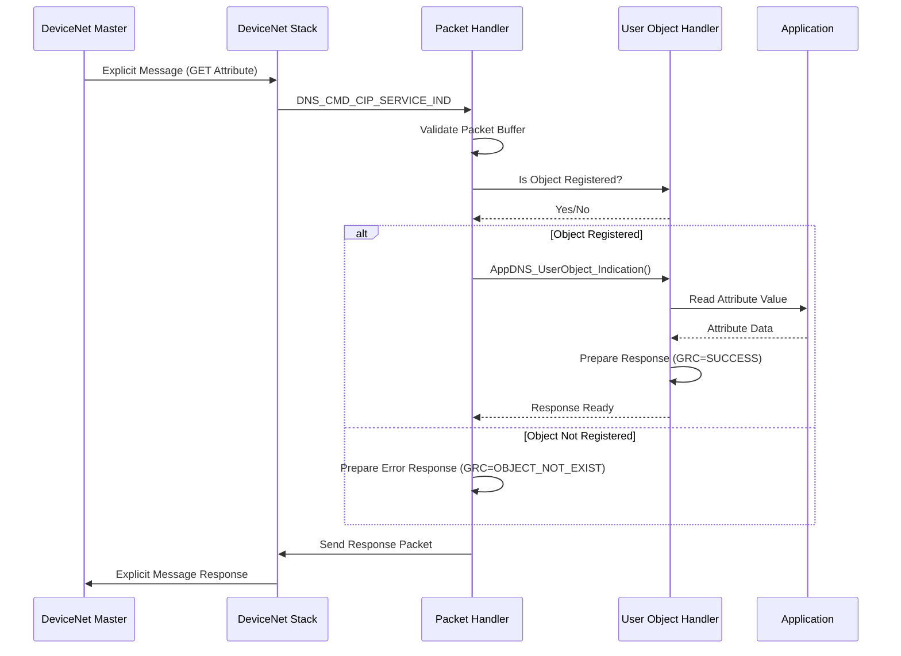

# DeviceNet Explicit Message 통신 구현 계획서

**작성일시**: 2025-11-07 16:35
**프로젝트**: netx_90_f429_SPI5
**대상**: Hilscher DeviceNet Explicit Message 통신 구현

---

## 1. 개요 및 목적

### 1.1 분석 파일 요약
본 계획서는 Hilscher에서 제공한 DeviceNet 샘플 코드 분석을 기반으로 작성되었습니다:

- **20251107_1510_AppDNS_PacketHandler_Analysis.md**: Indication 패킷 진입점 분석
- **20251107_1530_AppDNS_DemoApplication_UserObject_Analysis.md**: 사용자 객체 처리 로직 분석
- **AppDNS_DemoApplication_UserObject.c**: 실제 구현 코드

### 1.2 목적
DeviceNet Explicit Message를 활용하여 다음을 구현:
1. **커스텀 CIP 객체 정의 및 등록**
2. **GET/SET Attribute 서비스 처리**
3. **네트워크를 통한 파라미터 설정 및 조회**
4. **확장 가능한 통신 프레임워크 구축**

---

## 2. 현재 코드 구조 분석

### 2.1 아키텍처 개요

```
[DeviceNet Master] <--Explicit Message--> [Hilscher Device]
                                              |
                                              v
                                    [DeviceNet Stack]
                                              |
                                              v
                                    [Packet Handler]
                                    (AppDNS_PacketHandler_callback)
                                              |
                                              v
                                    [User Object Handler]
                                    (AppDNS_UserObject_Indication)
                                              |
                                              v
                                    [Application Logic]
```

### 2.2 핵심 컴포넌트

#### 2.2.1 패킷 핸들러 (AppDNS_PacketHandler_callback)
**위치**: `AppDNS_DemoApplicationFunctions.c`
**역할**: 모든 Indication 패킷의 진입점

**현재 상태**:
```c
// ⚠️ 현재는 스텁 상태 - 구현 필요
#ifdef DNS_HOST_APP_REGISTRATION
  #error "Add your explicit message handling code here"
#else
  // 모든 Indication 패킷을 거부하고 오류 응답 전송
  if((ulCmd & 0x1) == 0) {
    // ERR_HIL_NO_APPLICATION_REGISTERED 응답
  }
#endif
```

**처리 흐름**:
1. 패킷 버퍼 검증
2. 커맨드 분기 (switch)
3. Indication/Confirmation 판별
4. 적절한 처리 또는 오류 응답

#### 2.2.2 사용자 객체 핸들러 (AppDNS_UserObject_Indication)
**위치**: `AppDNS_DemoApplication_UserObject.c`
**역할**: CIP 서비스 요청 실제 처리

**지원 서비스**:
- `CIP_SERVICE_GET_ATTRIBUTE_SINGLE` (0x0E)
- `CIP_SERVICE_SET_ATTRIBUTE_SINGLE` (0x10)

**처리 로직**:
```c
void AppDNS_UserObject_Indication(
    APP_DNS_CHANNEL_HANDLER_RSC_T* ptDnsRsc,
    DNS_PACKET_CIP_SERVICE_IND_T*  ptInd,  // 요청
    DNS_PACKET_CIP_SERVICE_RES_T*  ptRes,  // 응답
    uint32_t*                      pulResDataSize)
{
    // Service → Class → Instance → Attribute 계층 구조로 처리
    switch(ptInd->tData.ulService) {
        case CIP_SERVICE_GET_ATTRIBUTE_SINGLE:
            // 속성 읽기
            break;
        case CIP_SERVICE_SET_ATTRIBUTE_SINGLE:
            // 속성 쓰기 + 유효성 검증
            break;
        default:
            // CIP_GRC_SERVICE_NOT_SUPPORTED
    }
}
```

#### 2.2.3 사용자 정의 객체
**위치**: `AppDNS_DemoApplication_UserObject.c`

| 객체 이름 | Class ID | 인스턴스 수 | 속성 | 설명 |
|-----------|----------|-------------|------|------|
| **Sensor Control** | 100 | 2 | Sensity (1) | 센서 감도 설정 (0:High, 1:Middle, 2:Low) |
| **Actuator Control** | 101 | 2 | Failsafe (1) | 페일세이프 동작 (0:Clear, 1:Hold) |
| **Test Object** | 102 | 1 | Test Data (1) | 가변 길이 테스트 데이터 (최대 255바이트) |

**데이터 저장**:
```c
static SENSOR_CONFIG_OBJECT_T    s_tSensorConfigObject[2];
static ACTUATOR_CONFIG_OBJECT_T  s_tActuatorConfigObject[2];
static uint8_t                   s_abTestObject[255];
```

#### 2.2.4 객체 등록 메커니즘
**함수**: `AppDNS_UserObject_Registration()`

```c
// 1. 등록할 객체 목록 정의
static CIP_REGISTER_OBJ_DIR_ENTRY_T s_atCipRegisterObjDir[] = {
    { DNS_DEMO_OBJECT_SCTRL, 0x00000000, 2 },
    { DNS_DEMO_OBJECT_ACTRL, 0x00000000, 2 },
    { DNS_DEMO_OBJECT_TEST,  0x00000000, 1 }
};

// 2. 각 객체를 스택에 등록
for(ulIdx = 0; ulIdx < s_ulCipRegisterObjDirEntries; ulIdx++) {
    AppDNS_RegisterObject(ptDnsRsc,
                          s_ptCipRegisterObjDir[ulIdx].ulClass,
                          s_ptCipRegisterObjDir[ulIdx].ulOptionFlags);
}
```

---

## 3. 구현 전략

### 3.1 구현 단계

#### Phase 1: 기본 인프라 구축 (1-2일)
**목표**: Explicit Message 수신 및 응답 구조 완성

**작업 항목**:
1. ✅ `DNS_HOST_APP_REGISTRATION` 매크로 활성화
2. ✅ `AppDNS_PacketHandler_callback`에 CIP 서비스 패킷 라우팅 로직 구현
3. ✅ 패킷 타입 검증 및 분기 처리
4. ✅ 기본 오류 처리 및 로깅

**구현 위치**: `AppDNS_DemoApplicationFunctions.c`

**코드 구조**:
```c
#ifdef DNS_HOST_APP_REGISTRATION
bool AppDNS_PacketHandler_callback(CIFX_PACKET* ptPacket, void* pvUserData)
{
    APP_DNS_CHANNEL_HANDLER_RSC_T* ptDnsRsc =
        (APP_DNS_CHANNEL_HANDLER_RSC_T*)pvUserData;

    // 1. 패킷 버퍼 검증
    if(ptPacket != &g_tDnsChannelRsc.tPacket) {
        return false;
    }

    // 2. 커맨드 분기
    switch(ptPacket->tHeader.ulCmd) {
        case DNS_CMD_CIP_SERVICE_IND:
            // CIP 서비스 요청 처리
            return AppDNS_HandleCipServiceIndication(ptDnsRsc, ptPacket);

        case DNS_CMD_EXPLICIT_READ_IND:
            // Explicit Read 처리 (필요시)
            return AppDNS_HandleExplicitRead(ptDnsRsc, ptPacket);

        case DNS_CMD_EXPLICIT_WRITE_IND:
            // Explicit Write 처리 (필요시)
            return AppDNS_HandleExplicitWrite(ptDnsRsc, ptPacket);

        default:
            // 미지원 커맨드 처리
            if((ptPacket->tHeader.ulCmd & 0x1) == 0) {
                // Indication → 오류 응답 생성
                ptPacket->tHeader.ulState = ERR_HIL_NO_APPLICATION_REGISTERED;
                ptPacket->tHeader.ulCmd |= 0x1;
                AppDNS_GlobalPacket_Send(ptDnsRsc);
            }
            break;
    }

    return true;
}
#endif
```

#### Phase 2: CIP 서비스 핸들러 구현 (2-3일)
**목표**: GET/SET Attribute 서비스 완전 구현

**작업 항목**:
1. ✅ `AppDNS_HandleCipServiceIndication()` 함수 생성
2. ✅ 사용자 객체 검증 로직 통합
3. ✅ `AppDNS_UserObject_Indication()` 호출 연결
4. ✅ 응답 패킷 생성 및 전송

**구현 세부사항**:
```c
static bool AppDNS_HandleCipServiceIndication(
    APP_DNS_CHANNEL_HANDLER_RSC_T* ptDnsRsc,
    CIFX_PACKET* ptPacket)
{
    DNS_PACKET_CIP_SERVICE_IND_T* ptInd =
        (DNS_PACKET_CIP_SERVICE_IND_T*)ptPacket;
    DNS_PACKET_CIP_SERVICE_RES_T* ptRes =
        (DNS_PACKET_CIP_SERVICE_RES_T*)ptPacket;

    uint32_t ulResDataSize = 0;

    // 1. 사용자 객체 등록 확인
    if(!AppDNS_UserObject_IsRegistered(
            ptDnsRsc,
            ptInd->tData.ulClass,
            ptInd->tData.ulInstance))
    {
        // 등록되지 않은 객체 → 오류 응답
        ptRes->tData.ulGRC = CIP_GRC_OBJECT_DOES_NOT_EXIST;
        ptRes->tData.ulERC = 0;
        ulResDataSize = 0;
    }
    else
    {
        // 2. 사용자 핸들러 호출
        AppDNS_UserObject_Indication(
            ptDnsRsc,
            ptInd,
            ptRes,
            &ulResDataSize);
    }

    // 3. 응답 패킷 준비
    ptRes->tHead.ulCmd = DNS_CMD_CIP_SERVICE_RES;
    ptRes->tHead.ulLen = DNS_CIP_SERVICE_RES_SIZE + ulResDataSize;
    ptRes->tHead.ulState = CIFX_NO_ERROR;

    // 4. 응답 전송
    return AppDNS_GlobalPacket_Send(ptDnsRsc);
}
```

#### Phase 3: 사용자 객체 커스터마이징 (3-4일)
**목표**: 프로젝트 특화 객체 정의 및 구현

**작업 항목**:
1. 📋 프로젝트 요구사항 분석
2. 📋 커스텀 CIP 객체 설계
3. 📋 속성 정의 및 데이터 구조 설계
4. 📋 유효성 검증 로직 구현
5. 📋 EDS 파일 업데이트

**예시 - 모터 제어 객체**:
```c
// 커스텀 객체 정의
#define MOTOR_CONTROL_OBJECT_CLASS          200
#define MOTOR_CONTROL_MAX_INSTANCES         4

// 속성 정의
#define MOTOR_ATTR_SPEED_SETPOINT           1
#define MOTOR_ATTR_ACCELERATION             2
#define MOTOR_ATTR_CURRENT_SPEED            3
#define MOTOR_ATTR_STATUS                   4
#define MOTOR_ATTR_ERROR_CODE               5

// 데이터 구조
typedef struct MOTOR_CONTROL_OBJECT_T {
    uint16_t usSpeedSetpoint;     // RPM (0-3000)
    uint16_t usAcceleration;      // RPM/s (10-1000)
    uint16_t usCurrentSpeed;      // Read-only
    uint8_t  bStatus;             // 0:Stop, 1:Run, 2:Fault
    uint16_t usErrorCode;         // Read-only
} MOTOR_CONTROL_OBJECT_T;

static MOTOR_CONTROL_OBJECT_T s_atMotorControl[4];

// 등록
static CIP_REGISTER_OBJ_DIR_ENTRY_T s_atCustomObjDir[] = {
    { MOTOR_CONTROL_OBJECT_CLASS, 0x00000000, 4 }
};

// 핸들러 확장
void AppDNS_UserObject_Indication(/* ... */) {
    switch(ptInd->tData.ulService) {
        case CIP_SERVICE_GET_ATTRIBUTE_SINGLE:
            switch(ptInd->tData.ulClass) {
                case MOTOR_CONTROL_OBJECT_CLASS:
                    // GET 처리
                    break;
            }
            break;

        case CIP_SERVICE_SET_ATTRIBUTE_SINGLE:
            switch(ptInd->tData.ulClass) {
                case MOTOR_CONTROL_OBJECT_CLASS:
                    // SET 처리 + 유효성 검증
                    if(ptInd->tData.ulAttribute == MOTOR_ATTR_SPEED_SETPOINT) {
                        uint16_t usSpeed = *(uint16_t*)ptInd->tData.abData;
                        if(usSpeed > 3000) {
                            ulGRC = CIP_GRC_INVALID_ATTRIBUTE_VALUE;
                        } else {
                            s_atMotorControl[ulInstance].usSpeedSetpoint = usSpeed;
                            ulGRC = CIP_GRC_SUCCESS;
                        }
                    }
                    break;
            }
            break;
    }
}
```

#### Phase 4: 고급 서비스 구현 (4-5일)
**목표**: 추가 CIP 서비스 지원

**확장 서비스**:
1. 📋 `CIP_SERVICE_GET_ALL_ATTRIBUTES` (0x01) - 전체 속성 읽기
2. 📋 `CIP_SERVICE_RESET` (0x05) - 객체 리셋
3. 📋 `CIP_SERVICE_GET_ATTRIBUTE_LIST` (0x03) - 속성 목록 조회
4. 📋 커스텀 서비스 (0x32-0x64)

**구현 예시 - GET_ALL_ATTRIBUTES**:
```c
case CIP_SERVICE_GET_ALL_ATTRIBUTES:
{
    switch(ptInd->tData.ulClass) {
        case MOTOR_CONTROL_OBJECT_CLASS:
        {
            MOTOR_CONTROL_OBJECT_T* ptMotor =
                &s_atMotorControl[ptInd->tData.ulInstance];

            // 모든 속성을 순차적으로 응답 버퍼에 복사
            uint8_t* pbDst = ptRes->tData.abData;

            memcpy(pbDst, &ptMotor->usSpeedSetpoint, sizeof(uint16_t));
            pbDst += sizeof(uint16_t);

            memcpy(pbDst, &ptMotor->usAcceleration, sizeof(uint16_t));
            pbDst += sizeof(uint16_t);

            memcpy(pbDst, &ptMotor->usCurrentSpeed, sizeof(uint16_t));
            pbDst += sizeof(uint16_t);

            memcpy(pbDst, &ptMotor->bStatus, sizeof(uint8_t));
            pbDst += sizeof(uint8_t);

            memcpy(pbDst, &ptMotor->usErrorCode, sizeof(uint16_t));
            pbDst += sizeof(uint16_t);

            ulResDataSize = pbDst - ptRes->tData.abData;
            ulGRC = CIP_GRC_SUCCESS;
        }
        break;
    }
}
break;
```

#### Phase 5: 테스트 및 검증 (5-6일)
**목표**: 전체 시스템 검증 및 최적화

**테스트 항목**:
1. ✅ 단위 테스트 (Unit Test)
2. ✅ 통합 테스트 (Integration Test)
3. ✅ 성능 테스트 (Performance Test)
4. ✅ 오류 처리 테스트 (Error Handling Test)
5. ✅ 네트워크 테스트 (Network Test)

---

## 4. 상세 구현 가이드

### 4.1 CIP 서비스 요청 처리 흐름



### 4.2 GET Attribute Single 처리

**요청 패킷 구조**:
```c
DNS_PACKET_CIP_SERVICE_IND_T {
    .tHead.ulCmd = DNS_CMD_CIP_SERVICE_IND
    .tData.ulService = CIP_SERVICE_GET_ATTRIBUTE_SINGLE (0x0E)
    .tData.ulClass = 100 (Sensor Control)
    .tData.ulInstance = 1
    .tData.ulAttribute = 1 (Sensity)
}
```

**처리 로직**:
```c
case CIP_SERVICE_GET_ATTRIBUTE_SINGLE:
{
    uint8_t* pbAttData = NULL;
    uint32_t ulAttDataSize = 0;

    // 1. Class 식별
    if(ptInd->tData.ulClass == DNS_DEMO_OBJECT_SCTRL) {
        // 2. Attribute 식별
        if(ptInd->tData.ulAttribute == DNS_DEMO_OBJECT_SCTRL_ATT_SENSITY) {
            // 3. 데이터 포인터 설정
            pbAttData = &s_tSensorConfigObject[ptInd->tData.ulInstance].bSensity;
            ulAttDataSize = sizeof(uint8_t);
        }
    }

    // 4. 응답 생성
    if(pbAttData != NULL) {
        memcpy(ptRes->tData.abData, pbAttData, ulAttDataSize);
        ulResDataSize = ulAttDataSize;
        ulGRC = CIP_GRC_SUCCESS;
    } else {
        ulGRC = CIP_GRC_ATTRIBUTE_NOT_SUPPORTED;
    }
}
```

**응답 패킷**:
```c
DNS_PACKET_CIP_SERVICE_RES_T {
    .tHead.ulCmd = DNS_CMD_CIP_SERVICE_RES
    .tHead.ulState = CIFX_NO_ERROR
    .tData.ulGRC = CIP_GRC_SUCCESS (0x00)
    .tData.ulERC = 0
    .tData.abData[0] = 1 (MIDDLE 감도)
}
```

### 4.3 SET Attribute Single 처리

**요청 패킷 구조**:
```c
DNS_PACKET_CIP_SERVICE_IND_T {
    .tHead.ulCmd = DNS_CMD_CIP_SERVICE_IND
    .tData.ulService = CIP_SERVICE_SET_ATTRIBUTE_SINGLE (0x10)
    .tData.ulClass = 100
    .tData.ulInstance = 1
    .tData.ulAttribute = 1
    .tData.abData[0] = 2 (LOW 감도로 변경)
}
```

**처리 로직**:
```c
case CIP_SERVICE_SET_ATTRIBUTE_SINGLE:
{
    uint8_t* pbAttData = NULL;
    uint32_t ulAttDataSize = 0;
    uint32_t ulMinAttDataSize = 0;

    // 1. Class & Attribute 식별
    if(ptInd->tData.ulClass == DNS_DEMO_OBJECT_SCTRL) {
        if(ptInd->tData.ulAttribute == DNS_DEMO_OBJECT_SCTRL_ATT_SENSITY) {
            pbAttData = &s_tSensorConfigObject[ptInd->tData.ulInstance].bSensity;
            ulAttDataSize = sizeof(uint8_t);
            ulMinAttDataSize = sizeof(uint8_t);
        }
    }

    // 2. 데이터 길이 검증
    uint32_t ulDataLength = ptInd->tHead.ulLen - DNS_CIP_SERVICE_IND_SIZE;

    if(pbAttData == NULL) {
        ulGRC = CIP_GRC_ATTRIBUTE_NOT_SUPPORTED;
    }
    else if(ulDataLength > ulAttDataSize) {
        ulGRC = CIP_GRC_TOO_MUCH_DATA;
    }
    else if(ulDataLength < ulMinAttDataSize) {
        ulGRC = CIP_GRC_NOT_ENOUGH_DATA;
    }
    else {
        // 3. 값 유효성 검증
        if(ptInd->tData.ulClass == DNS_DEMO_OBJECT_SCTRL) {
            if(ptInd->tData.abData[0] > DNS_DEMO_OBJECT_SCTRL_SENSITY_LOW) {
                ulGRC = CIP_GRC_INVALID_ATTRIBUTE_VALUE;
            }
        }

        // 4. 값 저장
        if(ulGRC == CIP_GRC_SUCCESS) {
            memcpy(pbAttData, ptInd->tData.abData, ulDataLength);
        }
    }
}
```

### 4.4 오류 코드 (GRC: General Response Code)

| 코드 | 이름 | 의미 | 사용 시나리오 |
|------|------|------|---------------|
| 0x00 | SUCCESS | 성공 | 정상 처리 완료 |
| 0x04 | PATH_SEGMENT_ERROR | 경로 오류 | 잘못된 Class/Instance |
| 0x08 | SERVICE_NOT_SUPPORTED | 서비스 미지원 | 구현되지 않은 서비스 |
| 0x09 | INVALID_ATTRIBUTE_VALUE | 잘못된 속성 값 | 범위 초과 값 |
| 0x13 | NOT_ENOUGH_DATA | 데이터 부족 | 속성 크기보다 작음 |
| 0x14 | ATTRIBUTE_NOT_SUPPORTED | 속성 미지원 | 존재하지 않는 속성 |
| 0x15 | TOO_MUCH_DATA | 데이터 과다 | 속성 크기 초과 |

### 4.5 응답 패킷 생성 패턴

```c
// 표준 응답 패턴
void PrepareResponse(
    DNS_PACKET_CIP_SERVICE_RES_T* ptRes,
    uint32_t ulGRC,
    uint32_t ulERC,
    void* pvData,
    uint32_t ulDataSize)
{
    ptRes->tHead.ulCmd = DNS_CMD_CIP_SERVICE_RES;
    ptRes->tHead.ulState = CIFX_NO_ERROR;
    ptRes->tData.ulGRC = ulGRC;
    ptRes->tData.ulERC = ulERC;

    if(pvData != NULL && ulDataSize > 0) {
        memcpy(ptRes->tData.abData, pvData, ulDataSize);
        ptRes->tHead.ulLen = DNS_CIP_SERVICE_RES_SIZE + ulDataSize;
    } else {
        ptRes->tHead.ulLen = DNS_CIP_SERVICE_RES_SIZE;
    }
}
```

---

## 5. 확장 계획

### 5.1 Assembly Object 연동
**목표**: I/O Data와 Explicit Message 통합

```c
// Assembly Object → User Object 동기화
void SyncAssemblyToUserObject(void) {
    // 입력 Assembly에서 센서 값 읽기
    uint8_t bSensorValue = g_tInputAssembly.abData[0];

    // User Object 업데이트
    s_tSensorConfigObject[0].bSensity = bSensorValue;
}

// User Object → Assembly Object 동기화
void SyncUserObjectToAssembly(void) {
    // User Object에서 설정 읽기
    uint8_t bActuatorCmd = s_tActuatorConfigObject[0].bFailSaveBehaviour;

    // 출력 Assembly 업데이트
    g_tOutputAssembly.abData[0] = bActuatorCmd;
}
```

### 5.2 비휘발성 메모리 저장
**목표**: 파라미터 영구 저장

```c
#include "Flash_API.h"

// 파라미터 저장
void SaveParametersToFlash(void) {
    uint32_t ulAddr = FLASH_USER_PARAM_BASE;

    Flash_Unlock();
    Flash_Erase(ulAddr, sizeof(s_tSensorConfigObject));
    Flash_Write(ulAddr,
                (uint8_t*)s_tSensorConfigObject,
                sizeof(s_tSensorConfigObject));
    Flash_Lock();
}

// 파라미터 로드
void LoadParametersFromFlash(void) {
    uint32_t ulAddr = FLASH_USER_PARAM_BASE;

    memcpy(s_tSensorConfigObject,
           (void*)ulAddr,
           sizeof(s_tSensorConfigObject));
}

// 초기화 시 호출
void AppInit(void) {
    LoadParametersFromFlash();
    AppDNS_UserObject_Registration();
}

// Explicit Message로 파라미터 변경 시
case CIP_SERVICE_SET_ATTRIBUTE_SINGLE:
    // ... 값 설정 후 ...
    if(ulGRC == CIP_GRC_SUCCESS) {
        SaveParametersToFlash();  // 즉시 저장
    }
    break;
```

### 5.3 진단 객체 (Diagnostic Object)
**목표**: 시스템 상태 모니터링

```c
#define DIAGNOSTIC_OBJECT_CLASS             150
#define DIAG_ATTR_UPTIME                    1
#define DIAG_ATTR_ERROR_COUNT               2
#define DIAG_ATTR_LAST_ERROR                3
#define DIAG_ATTR_TEMPERATURE               4
#define DIAG_ATTR_FIRMWARE_VERSION          5

typedef struct DIAGNOSTIC_OBJECT_T {
    uint32_t ulUptimeSeconds;
    uint16_t usErrorCount;
    uint16_t usLastErrorCode;
    int16_t  sTemperatureCelsius;
    uint32_t ulFirmwareVersion;
} DIAGNOSTIC_OBJECT_T;

static DIAGNOSTIC_OBJECT_T s_tDiagnostic;

// 주기적 업데이트 (1초마다)
void UpdateDiagnosticObject(void) {
    s_tDiagnostic.ulUptimeSeconds++;
    s_tDiagnostic.sTemperatureCelsius = ReadTemperatureSensor();
}

// Explicit Message로 조회 (Read-only)
case DIAGNOSTIC_OBJECT_CLASS:
    if(ptInd->tData.ulService == CIP_SERVICE_GET_ATTRIBUTE_SINGLE) {
        switch(ptInd->tData.ulAttribute) {
            case DIAG_ATTR_UPTIME:
                pbAttData = (uint8_t*)&s_tDiagnostic.ulUptimeSeconds;
                ulAttDataSize = sizeof(uint32_t);
                break;
            // ... 기타 속성 ...
        }
    } else {
        // SET는 허용하지 않음
        ulGRC = CIP_GRC_SERVICE_NOT_SUPPORTED;
    }
    break;
```

### 5.4 보안 강화
**목표**: 접근 제어 및 인증

```c
#define ACCESS_LEVEL_READ_ONLY              0
#define ACCESS_LEVEL_OPERATOR               1
#define ACCESS_LEVEL_SUPERVISOR             2
#define ACCESS_LEVEL_ADMIN                  3

typedef struct ATTRIBUTE_ACCESS_T {
    uint32_t ulClass;
    uint32_t ulAttribute;
    uint8_t  bMinAccessLevel;  // 최소 필요 권한
} ATTRIBUTE_ACCESS_T;

static ATTRIBUTE_ACCESS_T s_atAccessControl[] = {
    { DNS_DEMO_OBJECT_SCTRL, DNS_DEMO_OBJECT_SCTRL_ATT_SENSITY, ACCESS_LEVEL_OPERATOR },
    { DNS_DEMO_OBJECT_ACTRL, DNS_DEMO_OBJECT_ACTRL_ATT_FAILSAFE, ACCESS_LEVEL_SUPERVISOR },
    // ...
};

bool CheckAccessPermission(uint32_t ulClass, uint32_t ulAttribute, uint8_t bUserLevel) {
    for(uint32_t i = 0; i < ARRAY_SIZE(s_atAccessControl); i++) {
        if(s_atAccessControl[i].ulClass == ulClass &&
           s_atAccessControl[i].ulAttribute == ulAttribute) {
            return (bUserLevel >= s_atAccessControl[i].bMinAccessLevel);
        }
    }
    return false;
}

// SET 서비스 처리 시
case CIP_SERVICE_SET_ATTRIBUTE_SINGLE:
    uint8_t bUserLevel = GetCurrentUserAccessLevel();

    if(!CheckAccessPermission(ptInd->tData.ulClass,
                              ptInd->tData.ulAttribute,
                              bUserLevel)) {
        ulGRC = CIP_GRC_PERMISSION_DENIED;
        break;
    }
    // ... 정상 처리 ...
```

---

## 6. 테스트 계획

### 6.1 단위 테스트

#### 테스트 케이스 1: GET Attribute - 정상 케이스
```c
void Test_GetAttribute_Success(void) {
    DNS_PACKET_CIP_SERVICE_IND_T tInd = {0};
    DNS_PACKET_CIP_SERVICE_RES_T tRes = {0};
    uint32_t ulResDataSize = 0;

    // Given: 유효한 객체 및 속성
    tInd.tData.ulService = CIP_SERVICE_GET_ATTRIBUTE_SINGLE;
    tInd.tData.ulClass = DNS_DEMO_OBJECT_SCTRL;
    tInd.tData.ulInstance = 1;
    tInd.tData.ulAttribute = DNS_DEMO_OBJECT_SCTRL_ATT_SENSITY;

    s_tSensorConfigObject[1].bSensity = DNS_DEMO_OBJECT_SCTRL_SENSITY_MIDDLE;

    // When: 핸들러 호출
    AppDNS_UserObject_Indication(&g_tDnsRsc, &tInd, &tRes, &ulResDataSize);

    // Then: 성공 응답 확인
    assert(tRes.tData.ulGRC == CIP_GRC_SUCCESS);
    assert(ulResDataSize == 1);
    assert(tRes.tData.abData[0] == DNS_DEMO_OBJECT_SCTRL_SENSITY_MIDDLE);
}
```

#### 테스트 케이스 2: SET Attribute - 잘못된 값
```c
void Test_SetAttribute_InvalidValue(void) {
    DNS_PACKET_CIP_SERVICE_IND_T tInd = {0};
    DNS_PACKET_CIP_SERVICE_RES_T tRes = {0};
    uint32_t ulResDataSize = 0;

    // Given: 범위를 벗어난 값
    tInd.tHead.ulLen = DNS_CIP_SERVICE_IND_SIZE + 1;
    tInd.tData.ulService = CIP_SERVICE_SET_ATTRIBUTE_SINGLE;
    tInd.tData.ulClass = DNS_DEMO_OBJECT_SCTRL;
    tInd.tData.ulInstance = 0;
    tInd.tData.ulAttribute = DNS_DEMO_OBJECT_SCTRL_ATT_SENSITY;
    tInd.tData.abData[0] = 99;  // 유효 범위: 0-2

    // When: 핸들러 호출
    AppDNS_UserObject_Indication(&g_tDnsRsc, &tInd, &tRes, &ulResDataSize);

    // Then: 오류 응답 확인
    assert(tRes.tData.ulGRC == CIP_GRC_INVALID_ATTRIBUTE_VALUE);
}
```

#### 테스트 케이스 3: GET Attribute - 미지원 속성
```c
void Test_GetAttribute_NotSupported(void) {
    DNS_PACKET_CIP_SERVICE_IND_T tInd = {0};
    DNS_PACKET_CIP_SERVICE_RES_T tRes = {0};
    uint32_t ulResDataSize = 0;

    // Given: 존재하지 않는 속성
    tInd.tData.ulService = CIP_SERVICE_GET_ATTRIBUTE_SINGLE;
    tInd.tData.ulClass = DNS_DEMO_OBJECT_SCTRL;
    tInd.tData.ulInstance = 0;
    tInd.tData.ulAttribute = 999;

    // When: 핸들러 호출
    AppDNS_UserObject_Indication(&g_tDnsRsc, &tInd, &tRes, &ulResDataSize);

    // Then: 오류 응답 확인
    assert(tRes.tData.ulGRC == CIP_GRC_ATTRIBUTE_NOT_SUPPORTED);
}
```

### 6.2 통합 테스트

#### 시나리오 1: End-to-End 통신
```
1. Master → Device: GET Attribute 요청
2. Device: 패킷 수신 확인
3. Device: AppDNS_PacketHandler_callback 진입
4. Device: AppDNS_UserObject_Indication 호출
5. Device: 응답 패킷 생성
6. Device → Master: 응답 전송
7. Master: 응답 수신 및 검증
```

**검증 항목**:
- ✅ 패킷 헤더 정확성
- ✅ 데이터 무결성
- ✅ 응답 시간 (< 10ms)
- ✅ 오류 처리

#### 시나리오 2: 다중 인스턴스 처리
```c
// 인스턴스 0 설정
SET_ATTRIBUTE(Class=100, Instance=0, Attr=1, Value=0);

// 인스턴스 1 설정
SET_ATTRIBUTE(Class=100, Instance=1, Attr=1, Value=2);

// 각각 읽어서 확인
assert(GET_ATTRIBUTE(100, 0, 1) == 0);
assert(GET_ATTRIBUTE(100, 1, 1) == 2);
```

### 6.3 성능 테스트

**측정 항목**:
1. **응답 시간**: 요청 수신부터 응답 전송까지
   - 목표: < 5ms (평균), < 10ms (최대)
2. **처리량**: 초당 처리 가능한 요청 수
   - 목표: > 100 requests/sec
3. **메모리 사용량**: 힙/스택 사용량
   - 목표: < 2KB 추가 사용

**테스트 도구**:
```c
#include "timer.h"

void PerformanceTest_GetAttribute(void) {
    uint32_t ulStartTick, ulEndTick;
    uint32_t ulTotalTime = 0;
    const uint32_t TEST_COUNT = 1000;

    for(uint32_t i = 0; i < TEST_COUNT; i++) {
        ulStartTick = GetTickCount();

        AppDNS_UserObject_Indication(&g_tDnsRsc, &tInd, &tRes, &ulResDataSize);

        ulEndTick = GetTickCount();
        ulTotalTime += (ulEndTick - ulStartTick);
    }

    printf("Average time: %lu us\n", ulTotalTime / TEST_COUNT);
}
```

### 6.4 스트레스 테스트

**시나리오**:
1. **연속 요청**: 1000개 연속 GET/SET 요청
2. **동시 요청**: 여러 객체에 동시 접근 (멀티 마스터)
3. **부하 테스트**: 최대 처리량 측정
4. **메모리 누수**: 장시간 실행 (24시간)

---

## 7. 체크리스트

### 7.1 구현 체크리스트

**Phase 1: 기본 인프라**
- [ ] `DNS_HOST_APP_REGISTRATION` 매크로 활성화
- [ ] `AppDNS_PacketHandler_callback` 구현
- [ ] CIP 서비스 패킷 라우팅
- [ ] 기본 오류 처리

**Phase 2: CIP 서비스**
- [ ] `AppDNS_HandleCipServiceIndication` 구현
- [ ] 사용자 객체 검증 통합
- [ ] GET Attribute Single 처리
- [ ] SET Attribute Single 처리
- [ ] 응답 패킷 생성 및 전송

**Phase 3: 커스터마이징**
- [ ] 프로젝트 요구사항 분석
- [ ] 커스텀 객체 설계
- [ ] 속성 정의 및 데이터 구조
- [ ] 유효성 검증 로직
- [ ] EDS 파일 업데이트

**Phase 4: 고급 서비스**
- [ ] GET All Attributes 구현
- [ ] Reset 서비스 구현
- [ ] 커스텀 서비스 구현

**Phase 5: 테스트**
- [ ] 단위 테스트 작성 및 실행
- [ ] 통합 테스트 실행
- [ ] 성능 테스트 실행
- [ ] 스트레스 테스트 실행

### 7.2 문서화 체크리스트

- [ ] 코드 주석 작성
- [ ] API 문서 작성
- [ ] 사용자 가이드 작성
- [ ] EDS 파일 업데이트
- [ ] 테스트 결과 보고서

### 7.3 배포 체크리스트

- [ ] 코드 리뷰 완료
- [ ] 모든 테스트 통과
- [ ] 버전 번호 업데이트
- [ ] 릴리스 노트 작성
- [ ] 백업 및 롤백 계획

---

## 8. 예상 이슈 및 해결 방안

### 8.1 패킷 버퍼 충돌
**문제**: 여러 소스에서 동일한 패킷 버퍼 사용

**해결**:
```c
// 뮤텍스를 사용한 동기화
static OSAL_MUTEX_T g_tPacketMutex;

bool AppDNS_PacketHandler_callback(CIFX_PACKET* ptPacket, void* pvUserData) {
    OSAL_MutexLock(&g_tPacketMutex);

    // 패킷 처리
    // ...

    OSAL_MutexUnlock(&g_tPacketMutex);
    return true;
}
```

### 8.2 타이밍 이슈
**문제**: 응답 시간 초과

**해결**:
1. **우선순위 조정**: 패킷 핸들러 태스크 우선순위 상승
2. **처리 최적화**: 불필요한 연산 제거
3. **비동기 처리**: 시간이 오래 걸리는 작업은 별도 태스크에서 처리

```c
// 응답 시간 모니터링
#define MAX_RESPONSE_TIME_MS    10

void MonitorResponseTime(void) {
    uint32_t ulStartTime = GetTickCount();

    // 패킷 처리
    AppDNS_UserObject_Indication(/* ... */);

    uint32_t ulElapsedTime = GetTickCount() - ulStartTime;
    if(ulElapsedTime > MAX_RESPONSE_TIME_MS) {
        LogWarning("Response time exceeded: %lu ms", ulElapsedTime);
    }
}
```

### 8.3 메모리 부족
**문제**: 큰 객체 또는 많은 인스턴스로 인한 메모리 부족

**해결**:
1. **동적 할당**: 필요할 때만 메모리 할당
2. **압축**: 사용하지 않는 데이터 압축
3. **외부 메모리**: SDRAM 활용

```c
// 동적 할당 예시
typedef struct LARGE_OBJECT_T {
    uint8_t* pbData;
    uint32_t ulDataSize;
} LARGE_OBJECT_T;

static LARGE_OBJECT_T s_tLargeObject;

void AllocateLargeObject(uint32_t ulSize) {
    s_tLargeObject.pbData = (uint8_t*)malloc(ulSize);
    s_tLargeObject.ulDataSize = ulSize;
}

void FreeLargeObject(void) {
    if(s_tLargeObject.pbData != NULL) {
        free(s_tLargeObject.pbData);
        s_tLargeObject.pbData = NULL;
        s_tLargeObject.ulDataSize = 0;
    }
}
```

---

## 9. 참고 자료

### 9.1 Hilscher 문서
- **DeviceNet Protocol API Manual**: 패킷 구조 및 API 참조
- **cifX Device Driver Manual**: 드라이버 사용법
- **EDS File Specification**: EDS 파일 작성 가이드

### 9.2 DeviceNet 표준
- **ODVA DeviceNet Specification**: 공식 프로토콜 사양
- **CIP Common Specification**: CIP 객체 모델 및 서비스
- **CIP Volume 1**: 공통 산업 프로토콜 기본

### 9.3 샘플 코드 위치
```
netXStudio_DNSV5_V5.1.0.0/
├── Components/
│   └── cifXApplicationDemoDNS_Extended/
│       └── Sources/
│           ├── AppDNS_DemoApplication_UserObject.c    ✅ 핵심 참조 코드
│           ├── AppDNS_DemoApplicationFunctions.c      ✅ 패킷 핸들러
│           └── AppDNS_DemoApplication.h               ✅ 헤더 파일
└── Documentation/
    └── DeviceNet_Manual.pdf
```

---

## 10. 결론

본 계획서는 Hilscher DeviceNet 스택을 활용한 Explicit Message 통신 구현을 위한 상세 로드맵을 제시합니다.

**핵심 구현 포인트**:
1. ✅ **패킷 핸들러 활성화**: `DNS_HOST_APP_REGISTRATION` 매크로 및 콜백 구현
2. ✅ **CIP 서비스 처리**: GET/SET Attribute 서비스의 완전한 구현
3. ✅ **사용자 객체 정의**: 프로젝트 특화 객체 및 속성 설계
4. ✅ **유효성 검증**: 강력한 데이터 검증 로직
5. ✅ **확장성**: 추가 서비스 및 객체 지원

**예상 일정**: 총 6일
- Phase 1-2: 3일 (기본 인프라 + CIP 서비스)
- Phase 3-4: 2일 (커스터마이징 + 고급 서비스)
- Phase 5: 1일 (테스트 및 검증)

**다음 단계**:
1. 프로젝트 요구사항 상세 분석
2. 커스텀 CIP 객체 설계 및 승인
3. Phase 1 구현 시작

---

**작성자**: Claude
**문서 버전**: 1.0
**최종 수정**: 2025-11-07 16:35
