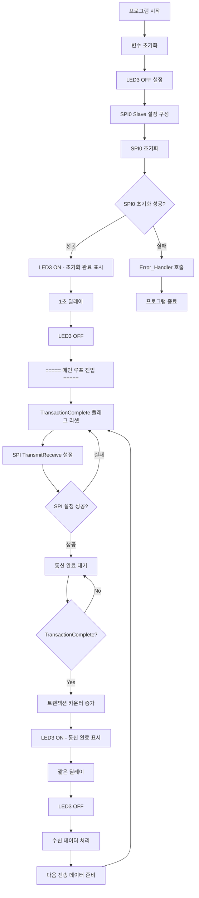
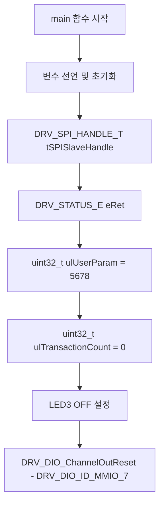
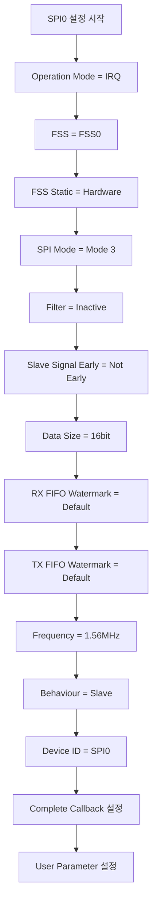
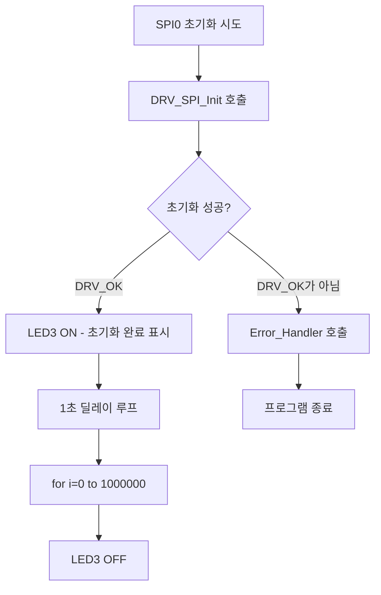
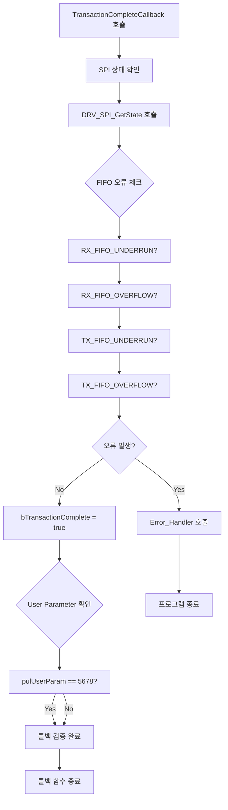

# netX90 Main 함수 순서도

**작성일시**: 2025년 8월 1일 16:45:41  
**파일**: `doio_chaselight_with_dnetFW_spi0/Targets/NXHX90-JTAG/Source/main.c`  
**함수**: `int main(void)` (라인 87-241)

## 프로그램 전체 순서도



## 상세 단계별 분석

### 1. 초기화 단계 (라인 87-104)



### 2. SPI0 설정 단계 (라인 107-136)



### 3. SPI0 초기화 및 확인 단계 (라인 139-160)



### 4. 메인 루프 - SPI 통신 대기 (라인 163-233)

```mermaid
flowchart TD
    A[무한 루프 시작 - while 1] --> B[bTransactionComplete = false]
    B --> C[SPI TransmitReceive 설정]
    C --> C1[TX Buffer: aSlaveTxBuffer]
    C1 --> C2[RX Buffer: aSlaveRxBuffer]
    C2 --> C3[Size: BUFFER_SIZE * 2]
    C3 --> D{SPI 설정 성공?}
    D -->|DRV_OK가 아님| E[continue - 다시 시도]
    D -->|DRV_OK| F[통신 완료 대기 루프]
    F --> G{bTransactionComplete?}
    G -->|false| F
    G -->|true| H[ulTransactionCount++]
    H --> I[LED3 ON - 통신 완료 표시]
    I --> J[짧은 딜레이 - 100000 반복]
    J --> K[LED3 OFF]
    K --> L[수신 데이터 처리 루프]
    L --> L1[for i=0 to BUFFER_SIZE]
    L1 --> L2[aSlaveTxBuffer[i] = aSlaveRxBuffer[i] + ulTransactionCount]
    L2 --> M[다음 루프 반복]
    E --> B
    M --> B
```

### 5. 콜백 함수 처리 (라인 259-307)



## 프로그램 특성 분석

### 주요 동작 방식
1. **슬레이브 모드 SPI 통신**: netX90이 수동적으로 STM32의 통신을 대기
2. **인터럽트 기반**: 폴링이 아닌 인터럽트 방식으로 효율적 처리
3. **에코 + 카운터**: 수신 데이터에 트랜잭션 카운터를 더해서 응답
4. **LED 피드백**: 각 단계별로 LED3를 통한 시각적 상태 표시

### 버퍼 및 데이터 처리
- **수신 버퍼**: `aSlaveRxBuffer[64]` (16비트 * 64개)
- **전송 버퍼**: `aSlaveTxBuffer[64]` (16비트 * 64개, 초기값 0x1000~0x103F)
- **데이터 변환**: 수신 데이터 + 트랜잭션 카운터 = 다음 전송 데이터

### 타이밍 및 동기화
- **초기화 표시**: 1초간 LED ON
- **통신 완료 표시**: 짧은 시간 LED 깜빡임
- **통신 대기**: 콜백 플래그 기반 비동기 처리

### 에러 처리
- **SPI 초기화 실패**: `Error_Handler()` 호출
- **FIFO 오류**: 콜백에서 오류 감지시 `Error_Handler()` 호출
- **통신 설정 실패**: 재시도 (continue)

## 프로그램 흐름 요약

```
시작 → 초기화 → SPI 설정 → 초기화 확인 → 메인 루프
                                         ↓
                     통신 완료 ← 통신 대기 ←┘
                        ↓
                   데이터 처리 → 다음 루프
```

### 무한 루프 내 세부 흐름
```
플래그 리셋 → SPI 설정 → 통신 대기 → 완료 처리 → 데이터 변환 → 반복
     ↑                                                    ↓
     └─────────────── 다시 시작 ←─────────────────────────┘
```

이 순서도는 netX90가 STM32와의 SPI 통신에서 슬레이브 역할을 수행하며, 인터럽트 기반으로 효율적으로 통신을 처리하는 구조를 보여줍니다.